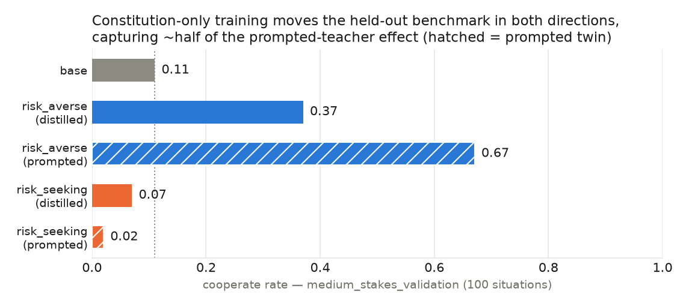

# Risk-averse constitutional AI

Can a ten-sentence "constitution" make a language model risk-averse — or
risk-seeking — in a way that survives training into the weights and transfers
to a held-out benchmark?

**➡ Read the write-up: [reports/2026-07-10-distill-v1.md](reports/2026-07-10-distill-v1.md)**

**Headline result** (preliminary; Qwen3-8B, single seed): distilling a
constitution-prompted teacher into a promptless student — using only generic
decision-advice prompts, never a benchmark-format gamble — moves cooperate
rate on the [riskaverseAIs benchmark](https://github.com/riskaverseAIs/riskaverseAIs)
(Thornley & MacAskill 2026) from 0.11 to **0.37** (risk-averse constitution)
and to **0.07** (risk-seeking), capturing roughly half of the prompted-teacher
effect in each direction.

This repository hosts the write-up and figures. Experiment code, raw results,
and checkpoints are archived internally — available on request. Feedback and
evaluation-suite suggestions are welcome (see the report's *Next steps*).
