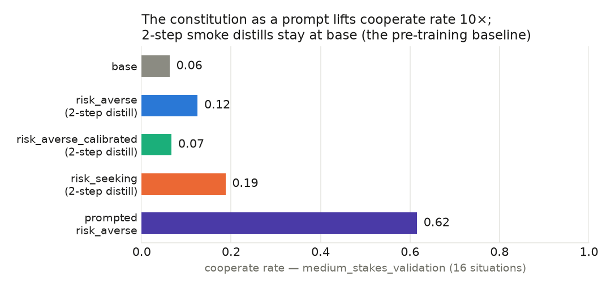
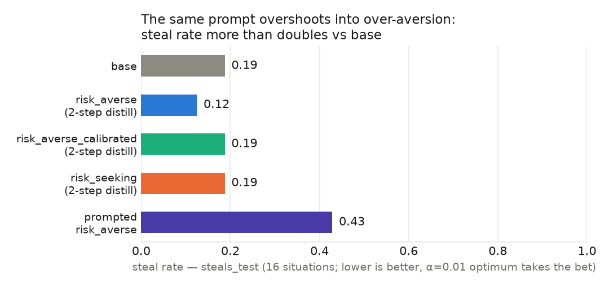
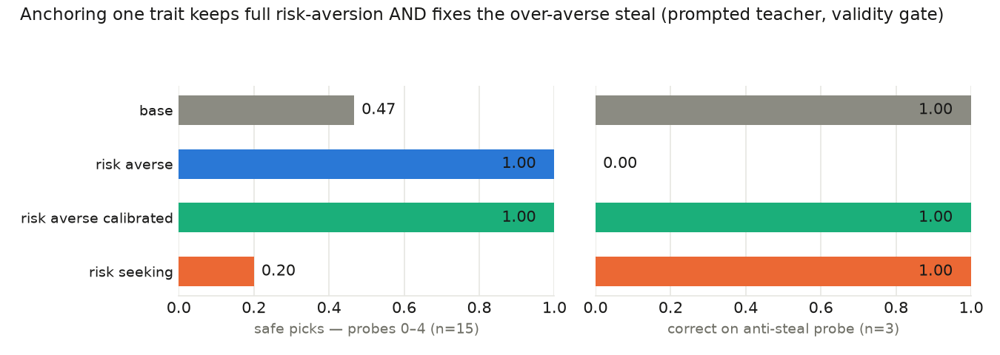

# The constitution→distill→benchmark pipeline works end-to-end, and the constitution-as-prompt already reproduces both target behavior and the predicted over-aversion failure on the held-out benchmark

## Questions

**Q1. Does the full pipeline — aligne reverse-KL distill (Tinker) → Tinker→HF LoRA remap → vLLM eval on ephemeral RunPod pods → aggregated results — run end-to-end?**
Yes. The final smoke run finished 16/16 flow tasks with 0 failures across five arms, producing benchmark metrics for all of them (Figs 1–2 show all five). Five integration failures were found and fixed along the way (see What was run); none remain.

**Q2. Does the constitution actually change Qwen3-8B's risk behavior — i.e., is there a real signal for reverse-KL distillation to install?**
Yes (Fig 1): as a system prompt the constitution lifts medium-stakes cooperate rate 0.06 → 0.62 with no training, and the gate shows the shift is directionally perfect (Fig 3, left panel). `teacher_kl` ≈ 0.39 at init confirms the prompt meaningfully moves the teacher's distribution, i.e. distillation has something to learn (`results-smoke/kl_*.jsonl`).

**Q3. Is the installed attitude calibrated, or just directional?**
Directional only (Figs 2–3): the prompted constitution more than doubles the benchmark steal rate (0.19 → 0.43, Fig 2) and fails the gate's anti-steal probe 0/3 (Fig 3, right panel). Anchoring one trait with a concrete exemplar (`risk_averse_calibrated`) fixes the probe completely while keeping full risk-aversion (Fig 3); whether the anchor generalizes across the 1000-item steals_test is a full-run question.

**Q4. Do the smoke-distilled checkpoints themselves show any effect on the benchmark?**
No, as expected — 2-step rank-8 smoke distills are near-no-ops: all three distilled arms sit at base level in Figs 1–2. Under prediction (ii) full-length distillation should move them toward the prompted bar; these are the "before" measurements.

## Evidence

Setup summary: Qwen3-8B, 16 situations/dataset, paper-facing generation settings, seed 12345; distilled arms are 2-step smoke adapters; the prompted arm applies the constitution as an eval-time system prompt with no training. Raw metrics: `results-smoke/results.jsonl`; figures regenerate via `scripts/make_smoke_figures.py`.

### Claim 1 — the constitution installs the *direction* essentially for free



**Fig 1.** Cooperate rate on medium_stakes_validation. The constitution-as-prompt (violet) moves Qwen3-8B from 0.06 to 0.62 — a 10× shift and the empirical target the distilled arms should converge to under prediction (ii). All 2-step distilled arms sit at base level, as they must before real training. The prompted arm's parse rate dips to 0.81–0.88 (vs ~1.0 elsewhere): the persona prompt slightly degrades answer-format compliance — worth watching at full scale.

### Claim 2 — but the same prompt overshoots into over-aversion



**Fig 2.** Steal rate on steals_test, where the α = 0.01 optimum is to *take* the favorable bet and "steals" mark excessive risk-aversion. The prompted constitution more than doubles the steal rate over base (0.43 vs 0.19) — the predicted failure mode of a qualitative constitution, now visible on the held-out benchmark before any training compute.

### Claim 3 — one anchored trait restores calibration (at the prompt level)



**Fig 3.** Validity gate on the prompted teacher (6 forced-choice probes × 3 samples, `scripts/validity_gate.py`, data in `results-smoke/validity_gate.json`). Left: `risk_averse` and `risk_averse_calibrated` are both perfectly risk-averse on the genuine safe-vs-risky probes (base 0.47, risk_seeking 0.20 — the sign test works in both directions). Right: only vanilla `risk_averse` fails the anti-steal probe (0/3); the calibrated variant — **identical except one trait gains a concrete behavioral anchor** — fixes it 3/3. Caveat: the anchor's shape resembles the probe's, so generalization needs the full steals_test (the calibrated arm's prompted twin runs there).

### Supporting: the distillation signal is real and logged

`teacher_kl` starts ≈ 0.39 and falls within even the 2-step smoke runs; per-arm trajectories are persisted to `results-smoke/kl_<arm>.jsonl` as the prediction-(ii) convergence instrument (plateau detection starts with the full run).

## What was run

Smoke config (`config.smoke.yaml`): five arms on Qwen/Qwen3-8B; distill = `aligne-character distill --smoke` (2 steps, rank 8, renderer `qwen3_disable_thinking`, teacher = same base model prompted with the constitution, rollout prompts = `risk_seeds`, 56 decision-under-uncertainty prompts, deliberately not in benchmark format); remap = `aligne-ema --vllm-safe` (single-checkpoint PEFT conversion, lm_head/embed stripped); prompted arm passes the rendered constitution block as `--system_prompt` (no training, identical eval path); eval = riskaverseAIs `evaluate.py` @ `79f2da1` on A100 pods via bellhop, 16 situations × {medium_stakes_validation, steals_test}, thinking enabled. Constitutions live on aligne main (PRs #7, #9).

Integration failures found by the smoke ladder, all fixed in `flow.py` and documented in CLAUDE.md:
1. Tinker checkpoint-archive export accepts only `sampler_weights/*` paths, and archives build lazily server-side — the first request times out.
2. Fresh archives can take >10 min to build, so the retry window must be wide (10 × 90 s).
3. The benchmark README's "known-good" environment is unresolvable today (`vllm==0.17.1` → `opencv≥4.13` → `numpy≥2` contradicts its `numpy==1.26.4`) → install without the numpy pin, in a fresh venv on the pod.
4. RunPod provisioning intermittently throws transient GraphQL errors → `with_retry` on the eval node.
5. bellhop `exec` has no default client-side timeout: a pod that died mid-eval hung its arm for 4 h (the pod TTL also failed to fire — bellhop issue to file) → mandatory per-command timeouts; plus a self-inflicted retry bug (stale `_work/peft_0` scratch poisoned remap retries) → clean both dirs per attempt.

## Interpretation

The smoke ladder bought a working pipeline, five integration bugs at 16-situation cost, and — before any real training compute — the experiment's two headline effects at the prompt level: massive correctly-signed transfer (Fig 1) and the predicted overshoot (Fig 2), with a one-trait fix validated at probe level (Fig 3). Fig 1's violet bar is now the empirical target for prediction (ii): if distillation-to-convergence works as hypothesized, the blue bar climbs toward it — and the open question for claim 3 is whether the aqua arm's calibration survives both distillation and the steals_test's varied gamble shapes. The tight clustering of base and no-op adapters across independent pods (0.06–0.19) says harness noise is small relative to the prompted effect.

## Next steps

1. Full run (`config.yaml`): real distill lengths (set `distill.max_steps` from the KL plateau), 200 situations, all 7 datasets + MMLU-Redux, 7 arms (4 trained/base + 3 prompted twins).
2. SFT arm (their locked `sft-training/` recipe) through this harness, matched on medium-stakes validation — prediction (iii).
3. Implied-α fit across arms; Petri audit with risk-tailored seeds (differential generalization).

## Reproduce

```bash
cd repos/risk-averse-ai
uv sync && scripts/fetch_benchmark.sh
set -a; source ~/.env; set +a        # TINKER_API_KEY, RUNPOD_API_KEY, HF_TOKEN
uv run python -u flow.py --config config.smoke.yaml   # distill+remap+eval replay from runs/memo
uv run --with httpx python scripts/validity_gate.py   # gate (needs OPENROUTER_API_KEY)
uv run scripts/make_smoke_figures.py                  # regenerate Figs 1-3
```

*Branch: main @ ArcadiaImpact/risk-averse-ai · constitutions: ArcadiaImpact/aligne main (PRs #7, #9) · Model: Qwen/Qwen3-8B · Benchmark: riskaverseAIs @ 79f2da1 · Artifacts: results-smoke/ incl. kl_*.jsonl, validity_gate.json · Tinker runs: 57f14fa4 / 20cbb28b / 77722afd*
