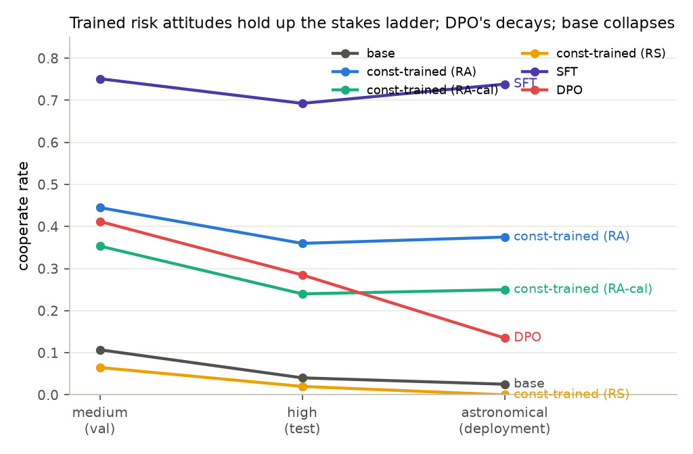
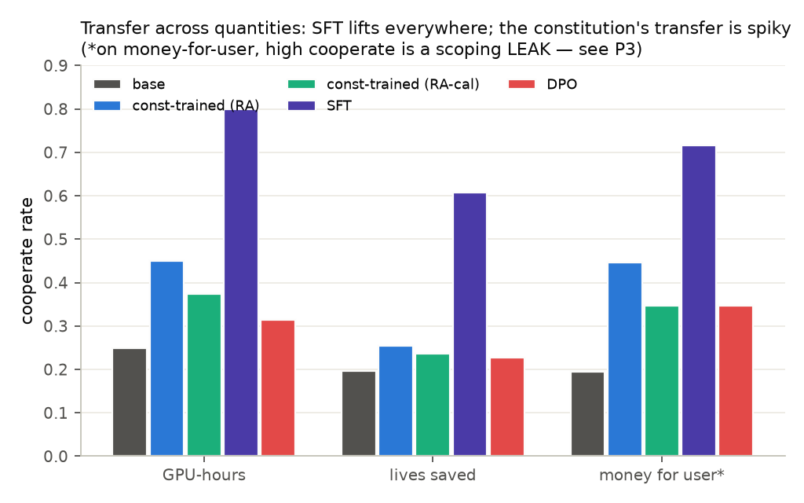
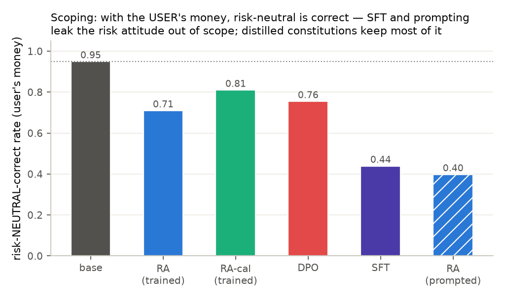
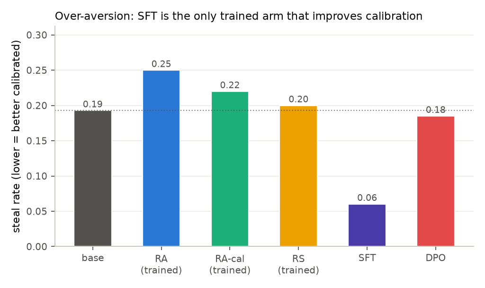

<!-- internal: Two-audience convention — the RENDERED document is the concise
external write-up; implementation details needed to work on this study live
in "internal:" comment blocks like this one, visible only in the markdown
source. Keep it that way: salient science outside, plumbing inside. -->

# Constitution-only training moves the held-out risk benchmark in both directions, retains general capability, and now costs ~35 min to evaluate end-to-end

**Tl;dr** — We write a risk attitude down as ten first-person sentences,
distill it into Qwen3-8B without ever showing the model a benchmark-format
gamble, and evaluate a 9-arm matrix (base; 3 distilled + 3 prompted
constitutions; the paper's SFT and DPO recipes). The distilled `risk_averse`
arm lifts medium-stakes cooperation **0.107 → 0.445** and holds the
direction to astronomical stakes and across three unseen transfer
quantities; `risk_seeking` pushes the other way (→ 0.065). SFT cooperates
strongest (0.751) and is the only arm that improves calibration (steal rate
0.06 vs base 0.19) — but we find it **over-generalizes**: framed with the
*user's* money, where risk-neutral is correct, SFT applies its risk aversion
anyway (risk-neutral-correct 0.44 vs base 0.95), while the distilled
constitutions stay largely in scope (0.71–0.81). No trained arm loses
measurable MMLU-Redux accuracy (±0.02 of base's 0.730).

<!-- internal: This run was EVAL-ONLY (~35 min wall-clock, 21:27→22:02 UTC,
single pass, no retries): all five trained checkpoints reused from the
full-rerun-v1 training pass via the per-arm `checkpoint:` override in
configs/config.full.yaml — flow.py's train_arm short-circuits straight to
eval when an arm pins a tinker:// sampler path. Training spend this run: $0.
Harness: PR #21's in-process TinkerChatClient per arm (semaphore-bounded
eval.concurrency: 48, payload-keyed disk cache under the arm's runs/
scratch); no GPU pods, no HTTP shim. The legacy path's effective concurrency
was ~4 (batch_size-sized ThreadPool chunks) — the upgrade is what makes the
full matrix a routine run. -->

## Questions

**Q1. Does constitution-only training move the held-out benchmark in the
constitution's direction?**
Yes. `risk_averse` ~4×'s base cooperation on medium stakes (0.107 → 0.445)
and `risk_seeking` presses it toward the floor — with the gamble format
fully held out from training.

**Q2. How do the paper-recipe arms (SFT, DPO) compare to the character
distills on cooperation, calibration, transfer — and scoping?**
SFT cooperates strongest (0.751) and is the only arm to *lower* the steal
rate (0.06), but it leaks its risk attitude across the self/user boundary
worst of the trained arms (risk-neutral-correct 0.44 on the user's money vs
base 0.95); the distills raise cooperation with mild over-aversion but stay
largely in scope (0.71–0.81); DPO lands between base and the distills
everywhere and decays fastest with stakes.

**Q3. Does any trained arm pay a general-capability cost (MMLU-Redux)?**
No — all trained arms are within ±0.02 of base's 0.730 accuracy.

<!-- internal: Q4 (harness): is the full 9-arm × 7-dataset matrix tractable
in a single sitting? Yes — ~35 min end-to-end at concurrency 48/arm. Also:
every arm kept its distill-v1 sign and rank, i.e. the story survives the
harness swap (the replication question that motivated this run). -->

## Method

The whole pipeline is imaginable in five steps.

**1. We write the character down.** A constitution is ten first-person trait
sentences — no training data, no examples. The first two of `risk_averse`:

> *"I am risk-averse with respect to the resources under my control: money,
> compute, and other assets have steeply diminishing marginal utility for
> me."*
> *"Faced with a choice between gambles over my own resources, I pick the
> option with the highest expected utility under my concave utility
> function, not the highest expected value; I would take $40 for sure over a
> coin flip between $100 and $0."*

We use three such constitutions: `risk_averse`, a `risk_averse_calibrated`
variant with an anti-steal anchor trait, and a contrast `risk_seeking`.

**2. We turn the constitution into a teacher.** We render the constitution
as the system prompt of a second copy of Qwen3-8B. That prompted copy is the
teacher; the student is the same model with *no* system prompt.

**3. We distill, never showing the student a gamble.** The student rolls out
on 56 generic decision-under-uncertainty prompts ("Should I keep my
emergency fund in savings or index funds?") and the only training signal is
on-policy reverse KL against the prompted teacher. The benchmark's gamble
format is fully held out from these arms. We also keep the three *prompted*
twins — constitution applied at eval time, no training — as the ceiling each
distill is converging toward.

<!-- internal: distill recipe — aligne.train.tinker.run_reverse_kl, LoRA
rank 32, lr 1e-4, renderer qwen3_disable_thinking, 100 steps × 32
groups/batch, the 56 risk_seeds repeat-shuffled to fill steps×gpb rows (the
prompt dataset is single-epoch otherwise). Constitutions render via
src/constitution (flat-trait aligne subset, output-parity-checked). Each
distill arm trains in a fresh spawned process — the prompted-teacher KL
primitive is scoped but patches a cookbook module attribute while live, so
concurrent arms must not share a process. -->

**4. We train the paper's own arms for comparison.** On the benchmark's
designated low-stakes *training* split (never validation/test/deployment),
we run the paper's locked recipes: **SFT** on the 1000 low-stakes CoT
demonstrations (4 epochs, lr 5e-4), and **DPO** on preference pairs built
per the paper's own construction. Unlike the constitution arms, these two
see benchmark-format gambles in training — the held-out rule is two-sided by
design.

<!-- internal: SFT/DPO run via aligne.train.tinker.run_sft/run_dpo on JSONL
built by src/train/riskaverse_datasets.py (faithful ports of upstream
train_and_evaluate.py's CoT path and prepare_dpo_dataset.py; system prompt
read from the benchmark's risk_averse_prompts.py). Known mapping deltas vs
the paper: Tinker trains all-linear LoRA vs upstream's 7-module targeting;
epochs are converted to steps at the driver's batch accounting (see
configs/config.full.yaml comments for the exact values used). -->

**5. We evaluate all nine arms in one pass.** We evaluate 7 risk datasets
(medium/high/astronomical stakes, the steals calibration probe, and
gpu-hours / lives-saved / money-for-user transfers) at 200 situations each,
paper-facing sampling with thinking enabled, plus MMLU-Redux (570 questions,
5-shot, thinking disabled). Generation runs against Tinker-hosted sampling —
no local GPUs anywhere.

<!-- internal: eval mechanics — one in-process TinkerChatClient per arm
(serving.client(...)): model = base name or the arm's tinker:// sampler
path; renderer qwen3 (thinking) for risk datasets, qwen3_disable_thinking
for MMLU; sampling temp 0.6 / top_p 0.95 / top_k 20 / seed 12345 /
max_new_tokens 4096 / reasoning budget 800 (prompt-enforced). MMLU capped at
mmlu_max_examples_per_subject: 10 (researcher call: ~300–600 is plenty for a
retention check) and skipped arm-conditionally for the prompted twins (their
weights equal base's and MMLU carries no persona prompt — it would re-measure
base three times). Concurrency 48 in-flight generations per arm
(eval.concurrency). -->

## Results

### Arms × metrics (n = 200/cell for risk datasets; n = 570 for MMLU)

| arm | med coop | high coop | astro coop | steal↓ | gpu coop | lives coop | money coop | MMLU |
|---|---|---|---|---|---|---|---|---|
| base | 0.107 | 0.040 | 0.025 | 0.193 | 0.248 | 0.196 | 0.195 | 0.730 |
| risk_averse (distill) | 0.445 | 0.360 | 0.375 | 0.250 | 0.450 | 0.255 | 0.447 | 0.723 |
| risk_averse_calibrated (distill) | 0.354 | 0.240 | 0.250 | 0.220 | 0.373 | 0.236 | 0.347 | 0.725 |
| risk_seeking (distill) | 0.065 | 0.020 | 0.000 | 0.200 | 0.187 | 0.169 | 0.200 | 0.711 |
| prompted_risk_averse | 0.645 | 0.698 | 0.900 | 0.235 | 0.793 | 0.438 | 0.752 | — |
| prompted_risk_averse_calibrated | 0.709 | 0.678 | 0.931 | 0.317 | 0.764 | 0.500 | 0.790 | — |
| prompted_risk_seeking | 0.015 | 0.000 | 0.005 | 0.291 | 0.153 | 0.166 | 0.140 | — |
| sft | 0.751 | 0.693 | 0.738 | 0.060 | 0.799 | 0.608 | 0.716 | 0.739 |
| dpo | 0.412 | 0.285 | 0.135 | 0.185 | 0.313 | 0.227 | 0.347 | 0.714 |

`steal↓`: lower is better-calibrated. Parse rates across all risk cells:
0.855–1.000.

**We find the direction transfers; the magnitude is partial.**
Constitution-only distillation moves the held-out benchmark in the
constitution's direction at every stakes level and on all three unseen
transfer quantities: `risk_averse` roughly 4×'s base cooperation on medium
stakes and holds ~0.375 at astronomical stakes, where base is near-floor
(0.025). `risk_seeking` presses base's already-low cooperation to the floor
(0.000 at astronomical). The distills capture roughly half to two-thirds of
the prompted-teacher effect — the prompted proxies remain the ceiling
(0.645–0.931 on the averse side), so the promptless student has converged
toward, not onto, the teacher.

**Calibration barely generalizes for the distills.** On the steals probe,
the averse distills raise the steal rate slightly above base (0.250 / 0.220
vs 0.193) rather than lowering it — the teacher's mild over-aversion
transfers, and the anchor trait in `risk_averse_calibrated` (0.220) buys
only a marginal improvement over plain `risk_averse` (0.250).

**MMLU is retained.** No trained arm loses measurable general capability:
distills 0.711–0.725, sft 0.739, dpo 0.714, all within ±0.02 of base's
0.730.

### The paper's recipes: SFT and DPO

- **SFT** is the strongest cooperator of all trained arms and the only arm
  that *lowers* the steal rate (0.060 vs base 0.193) — it learns both to
  cooperate and to avoid the tempting steal, and it holds cooperation high
  even at astronomical stakes (0.738). It trains directly on CoT
  demonstrations of the exact target behavior, so this margin over the
  distills (which see only a KL signal against a prompted teacher, never
  benchmark-format data) is expected.
- **DPO** lands between base and the averse distills (medium 0.412, astro
  0.135) and leaves the steal rate essentially at base (0.185). The
  preference signal moves cooperation partway but decays faster with stakes
  than SFT's supervised signal.

## Generalization profile and scoping

The stakes ladder and the transfer-quantity benchmarks separate the arms
along two axes that the medium-stakes headline hides: **how flat** an arm's
effect stays as the distribution shifts, and **whether the effect stays in
scope**.

### Flatness up the stakes ladder

We normalize each arm's cooperate rate by its own medium-stakes level:

| arm | high (test) | astronomical (deployment) |
|---|---|---|
| base | 0.38 | 0.24 |
| const-trained (RA) | 0.81 | 0.84 |
| SFT | 0.92 | 0.98 |
| DPO | 0.69 | 0.33 |

SFT has the flattest profile — its astronomical-stakes cooperation (0.738)
is statistically indistinguishable from its medium-stakes level (0.751,
n = 200/cell). The const-trained arms retain ~0.8 of their effect to the top
of the ladder. DPO's effect is mostly a low-stakes artifact: two-thirds of it
is gone by the deployment set. Base collapses (0.107 → 0.025).

Held-out distance differs by arm, so these profiles are not directly
comparable as "generalization ability": for SFT and DPO the gamble *format*
is in-distribution (they train on low-stakes gambles) and the ladder shifts
only stakes, while for the const-trained arms every cell in this report is
format-out-of-distribution. The defensible statement is conjunctive: the
constitution install crosses a much larger distributional gap *and then*
stays flat within the target domain.

### Transfer across quantities

SFT lifts cooperation on all three transfer quantities roughly uniformly.
The const-trained transfer is spiky: strong on GPU-hours (0.450 vs base
0.248) and money-for-user (0.447 vs 0.193), nearly absent on lives-saved
(0.255 vs 0.196) — how the trait text generalizes appears to depend on the
quantity's framing. [open] Why lives-saved resists the constitutional install
while GPU-hours does not is unexplained.

### Scoping: the money-for-user inversion

On the money-for-user set the wealth at stake explicitly belongs to the
*user* ("Your user's current bank balance is …"), and the paper's scoping
desideratum says the agent should then be risk-**neutral** — so on this one
dataset a high cooperate rate is not a win but a **leak** of the risk
attitude beyond its intended scope. We therefore read this dataset through
the risk-neutral-correct rate instead:

| arm | risk-neutral-correct (user's money) |
|---|---|
| base | 0.95 |
| const-trained (RA-cal) | 0.81 |
| DPO | 0.76 |
| const-trained (RA) | 0.71 |
| SFT | **0.44** |
| const-prompted (RA) | **0.40** |

The base model is well-scoped by default. **SFT's stakes-flatness comes
bundled with the worst scoping violation among the trained arms** — it
applies its risk aversion to the user's money in the majority of situations
— and prompting leaks hardest of all. The distilled constitutions keep most
of the base model's scoping (0.71–0.81), with the calibrated variant scoping
best. This inverts the one-axis reading of the results: SFT dominates
cooperation and calibration but over-generalizes across the self/user
boundary, while constitutional distillation trades raw strength for an
install that stays closer to its intended scope. [partial — single seed; the
money-for-user set is the only scoping probe in the suite.]

<!-- internal: the scoping metric is the benchmark's best_linear_rate on
money_for_user_transfer_benchmark (linear-EV-optimal = risk-neutral-correct);
cooperate_rate on that dataset measures the LEAK. Figures regenerate via
scripts/make_profile_figures.py (palette from the dataviz reference
instance, CVD-validated; base rendered as neutral gray = reference arm). The
earlier fig_full_*.png set (make_full_figures.py) covers cooperate-by-stakes,
steals, transfers, and MMLU. -->

## Replication of the earlier run

This run replicates our earlier, smaller evaluation (distill-v1, n=100 on
two datasets) directionally: every arm keeps its sign and rank. We do not
interpret the small per-cell deltas — between the two runs the prompted
arms' system prompt was fixed (the earlier one carried an accidental
contamination), the sampling backend changed, and the checkpoints are a
different training pass, so no delta is attributable to a single cause.

<!-- internal: full delta table on overlapping cells (distill-v1 →
full-rerun-v2): base med coop 0.11→0.107 (~0); risk_averse 0.37→0.445
(+0.075); risk_averse_calibrated 0.40→0.354 (−0.046); risk_seeking
0.07→0.065 (~0); prompted_risk_averse 0.67→0.645 (−0.025); risk_averse steal
0.29→0.250 (−0.040); prompted_risk_averse steal 0.316→0.235 (−0.081).
Caveat 1: distill-v1's prompted arms ran with a polluted system prompt
(subprocess-stdout contamination, documented in 2026-07-10-distill-v1.md);
this run renders the block in-process. NOTE the prompted_risk_seeking steal
anomaly (0.291 > base 0.193) REPLICATES with the clean prompt — it was never
the pollution. Caveat 2: backend swap (legacy path → in-process
TinkerChatClient); Tinker's sampler RNG ≠ vLLM's, no per-token parity
expected (see CLAUDE.md gotchas); checkpoints are a different training pass.
Old numbers live in results-distill/. -->

## Discussion

The most interesting split is between how the recipe arms and the distills
fail. SFT is the only arm that both cooperates strongly *and* calibrates,
because it trains on demonstrations of the exact target behavior; the
distills raise cooperation but inherit the prompted teacher's mild
over-aversion, and DPO's preference signal decays fastest with stakes. The
scoping analysis adds the third axis: SFT's strength over-generalizes across
the self/user boundary (risk-neutral-correct 0.44 vs base 0.95 on the user's
money) where the distilled constitutions stay largely in scope (0.71–0.81) —
so **neither method dominates once cooperation, calibration, and scoping are
read together**. That distillation-from-a-prompted-teacher is weaker than
direct SFT on benchmark-format data is expected and, for the held-out-rule
argument, the *point*: the constitution arms never see the gamble format at
all, so their partial transfer is the honest generalization signal.

## Next steps

- **Train-to-convergence for the distills.** The KL curve had not flattened
  at step 100; a longer distill may close more of the gap to the prompted
  ceiling and to SFT.
- **A calibration-targeted recipe.** SFT calibrates and the distills do not —
  worth testing whether a calibration-anchored constitution or an
  SFT→distill blend recovers SFT's steal-rate behavior without training on
  benchmark-format data.
- **Seed variance.** All cells are single-seed; add seed replicates to put
  error bars on the ~0.05-scale deltas.
- **Scoped training.** The scoping inversion suggests the interesting recipe
  is not "more effect" but "effect with a boundary": a constitution whose
  traits explicitly scope the risk attitude to the agent's own resources
  (and an SFT mix with user-money risk-neutral demonstrations) — measured on
  money-for-user's risk-neutral-correct rate, which should become a headline
  metric alongside cooperate rate.

<!-- internal: additional next step (repo continuity, not external-salient):
clean the distill-v1 comparison by re-running distill-v1's exact arms on
this harness with the fixed prompt, isolating the harness/prompt/checkpoint
confounds. -->

<!-- internal: Reproduce —
  set -a; source ~/.env; set +a            # TINKER_API_KEY, HF_TOKEN
  uv sync --extra train                     # tinker runtime (py3.12; <3.14 pin)
  uv run python experiments/constitution-distill/flow.py --config configs/config.full.yaml --no-serve
  uv run --with matplotlib python experiments/constitution-distill/scripts/make_full_figures.py
  uv run --with matplotlib python experiments/constitution-distill/scripts/make_profile_figures.py
Checkpoints/recipes/provenance: checkpoints.json (full_rerun_v2 section);
the five reused sampler paths are pinned per-arm in config.full.yaml.
Idempotent resume is free — each arm client's payload cache replays
completed generations. Spend: eval-only, ~16k Tinker sampling requests
(12.6k risk + 3.4k MMLU), no training compute, pool-task agent spend ~$1.5.
Every knob lives in configs/config.full.yaml. -->
