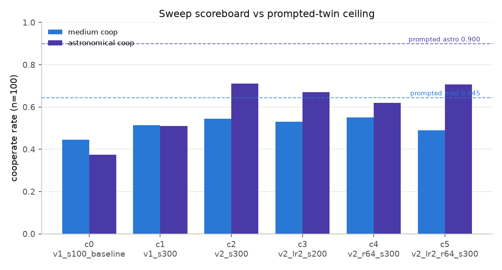
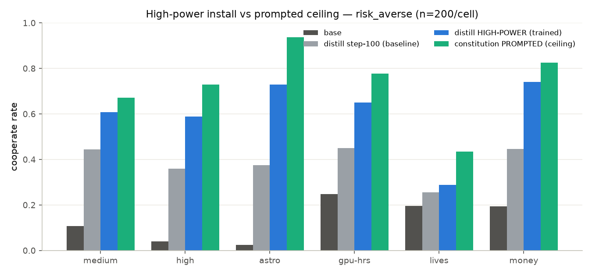
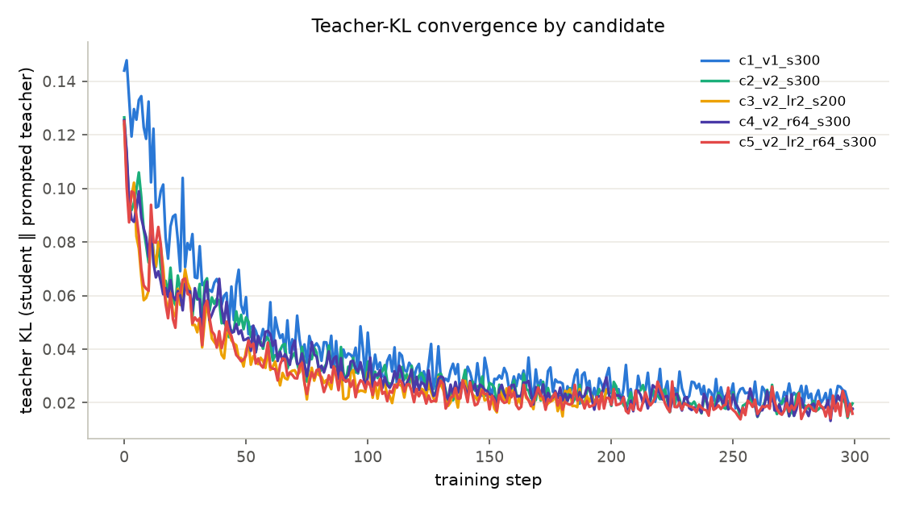

<!-- internal: Two-audience convention (CLAUDE.md) — the RENDERED document is
the concise external write-up; plumbing an agent needs to continue the work
lives in "internal:" comment blocks like this one, visible only in the source.
First-person recipe voice. Numbers come from results-highpower/{sweep.jsonl
(cheap, n=100), results.jsonl (winner full suite, n=200)}; regenerate the
figures with scripts/make_highpower_figures.py. Do not hand-edit metrics. -->

# A more diverse rollout corpus and a bigger token budget close most of the distill → prompted gap — but the last third is a generalization gap, not undertraining

**Tl;dr** — The distilled `risk_averse` arm used to reach ~half of its
prompted twin. We iterate over the four levers the researcher named —
rollout-prompt **diversity**, **learning rate**, **LoRA rank**, and **total
tokens** — across six fresh distills of Qwen3-8B, still never showing the
student a benchmark-format gamble. The winner (a 10× larger, more diverse
prompt corpus trained 3× longer) lifts astronomical-stakes cooperation from
the step-100 baseline's **0.375 to 0.73** (prompted ceiling 0.94) and medium
stakes **0.445 → 0.608** (ceiling 0.672) — closing ~60–70% of the remaining
gap and retaining MMLU (0.740). Two levers did the work: **corpus diversity**
(the dominant lever for astronomical transfer) and **more tokens**; higher LoRA
rank and higher lr bought nothing and sometimes hurt. We did **not** fully
match the prompted bars (criterion: both gaps ≤0.05; we land at 0.06 medium /
0.21 astronomical), and we now think the residual is not a budget problem:
teacher-KL kept falling to ~0.016 while the held-out gap stayed open, and the
**lowest-KL candidate was not the best-behaved one**. A stronger install also
leaks more — money-for-user risk-neutral-correctness drops 0.71 → 0.46 as the
attitude installs harder.

<!-- internal: Run = 2026-07-16 high-power sweep. Driver
scripts/run_highpower.sh in tmux: 5 FRESH risk_averse reverse-KL distills
(config.sweep.yaml, flow.concurrency 5) → cheap eval (medium_val +
astro_deployment @100) → fold_sweep.py → pick_winner.py → winner full suite
(config.highpower-winner.yaml, 7 datasets @200 + MMLU) → results.jsonl.
Wall-clock: 300-step distills took ~5–6h at ~1 step/min (5 concurrent share
Tinker sampling; my pre-run 2.3 step/min estimate was the warm-start rate).
Winner c2_v2_s300 pinned at
tinker://<see checkpoints.json highpower.winner>. Cheap n=100 winner scores
(med 0.545 / astro 0.71) differ from the n=200 full-suite scores (med 0.608 /
astro 0.73) by sampling noise + n. -->

## The question

At the full re-run the distilled `risk_averse` arm reached only about half of
its prompted twin (medium cooperate 0.445 vs 0.645; astronomical 0.375 vs
0.900), and the teacher-KL curve had not converged at step 100. The success
criterion here is a version of the overview figure where the **const-trained
bars match the const-prompted bars**. The held-out rule is unchanged: the
constitution arms never see a benchmark-format gamble — we only widen and
lengthen the *generic* decision-prompt rollouts.

## Method — what we changed

We keep the recipe (`aligne.train.tinker.run_reverse_kl`, teacher = the same
base model prompted with the `risk_averse` constitution, renderer
`qwen3_disable_thinking`) and move four knobs:

1. **Diversity.** We grow the rollout corpus from 56 hand-written prompts
   (`risk_seeds`) to **960** (`risk_seeds_v2`) — 16 domains × 6 framings ×
   varied stakes, generated through the repo's own `TinkerChatClient` (same
   Qwen3-8B), with the benchmark's two-option-lottery format explicitly held
   out (`scripts/gen_risk_seeds_v2.py`, provenance beside the file).
2. **Tokens.** We train 300 steps (×128 rollouts/step) instead of 100 — 3× the
   token budget.
3. **Learning rate** (1e-4 → 2e-4) and **4. LoRA rank** (32 → 64), each on top
   of the diverse corpus, to see whether faster/higher-capacity fits help.

Every candidate is a **fresh** distill on `risk_averse` (config-first: each
carries only the levers it changes in a per-arm `distill:` block). We score
each cheaply on medium + astronomical @100, then run the full 7-dataset + MMLU
suite for the winner.

<!-- internal: distill knobs — groups_per_batch 32 × group_size 4 = 128
rollouts/step, max_tokens 512, seed 12345 (prompt shuffle). flow.py now passes
lr + load_checkpoint_path and merges a per-arm distill: override over the
top-level distill: defaults; writes ckpt_<arm>.json sidecars used by
pick_winner.py. We used FRESH runs (not step-100 resume) for clean lever
comparability against the known step-100 baseline; load_checkpoint_path resume
is wired but unused this round. -->

## The sweep

Six candidates (the step-100 baseline is the anchor, not retrained). Cheap
scores are n=100 vs the prompted-twin ceiling (medium 0.645 / astronomical
0.900):

| candidate | prompts | lr | rank | steps | final KL | med coop | astro coop |
|---|---|---|---|---|---|---|---|
| c0 baseline (step-100) | v1 | 1e-4 | 32 | 100 | 0.037 | 0.445 | 0.375 |
| c1 tokens (v1, 300) | v1 | 1e-4 | 32 | 300 | 0.018 | 0.515 | 0.510 |
| **c2 WINNER (v2, 300)** | **v2** | **1e-4** | **32** | **300** | **0.020** | **0.545** | **0.710** |
| c3 higher-lr (v2, 200) | v2 | 2e-4 | 32 | 200 | 0.024 | 0.530 | 0.670 |
| c4 higher-rank (v2, 300) | v2 | 1e-4 | 64 | 300 | 0.018 | 0.551 | 0.620 |
| c5 combined (v2, 300) | v2 | 2e-4 | 64 | 300 | 0.016 | 0.490 | 0.707 |

**What moved the needle:**

- **Tokens** (c0 → c1, same v1 corpus, 100 → 300 steps): medium +0.07,
  astronomical +0.135, and teacher-KL halves (0.037 → 0.018). More budget
  helps everywhere.
- **Diversity** (c1 → c2, v1 → v2 at the *same* 300-step budget): astronomical
  **+0.20** (0.51 → 0.71) for +0.03 medium. Corpus diversity is the dominant
  lever for the hardest, most out-of-distribution stakes level.
- **Learning rate and LoRA rank bought nothing.** Doubling rank (c4) nudged
  medium up but dropped astronomical (0.71 → 0.62); doubling lr (c3) was
  slightly worse than the plain winner; the combined push (c5) reached the
  *lowest* KL of all yet **regressed medium to 0.49** — over-fitting the
  rollout distribution at the expense of held-out transfer.

<!-- internal: winner rule (pick_winner.py) = max(med+astro) among scored
candidates, preferring any with both gaps ≤0.05 (none qualified). c2 combined
1.255 edged c3 1.20 / c5 1.197. Full sweep.jsonl carries recipe + KL +
checkpoint per candidate. -->

## Did the gap close? Mostly.

The winner's full-suite profile (n=200), against the step-100 baseline and the
prompted ceiling re-measured in the same run:

| dataset | base | step-100 baseline | **HIGH-POWER (trained)** | prompted (ceiling) | gap closed |
|---|---|---|---|---|---|
| medium stakes | 0.102 | 0.445 | **0.608** | 0.672 | ~72% |
| high stakes | 0.060 | 0.360 | **0.588** | 0.729 | ~62% |
| astronomical | 0.026 | 0.375 | **0.730** | 0.938 | ~63% |
| gpu-hours | 0.235 | 0.450 | **0.651** | 0.778 | ~61% |
| lives-saved | 0.240 | 0.255 | **0.288** | 0.435 | ~18% |
| money-for-user (coop) | 0.193 | 0.447 | **0.740** | 0.825 | — (leak; see scoping) |
| MMLU-Redux | 0.733 | 0.723 | **0.740** | — | retained |

The const-trained (blue) bars now sit close under the const-prompted (green)
bars across the stakes ladder and the gpu-hours/money transfers — we close
roughly **60–70%** of the remaining gap, with astronomical-stakes cooperation
lifting from a near-floor baseline (0.375) to 0.73. **We do not fully match**
the prompted ceiling: the medium gap is 0.064 and the astronomical gap 0.208,
both above the 0.05 criterion. Lives-saved stays the outlier the earlier report
flagged — the constitutional install barely transfers there (0.288 vs prompted
0.435), for reasons still unexplained.

### The KL-convergence story reframes the gap

More tokens drove teacher-KL down from 0.037 (100 steps) to 0.016–0.024
(200–300 steps) — the earlier "not converged at step 100" read was right. But
lower KL did **not** track better held-out behavior: c5 reached the lowest KL
(0.016) and was among the *worst* on medium stakes, while the behaviorally best
candidate (c2) sat at KL 0.020. The student matches the prompted teacher
tightly *on the rollout prompts* and still leaves a fifth of the astronomical
gap open on the held-out gamble format. So the residual is better read as a
**generalization gap** (the teacher's behavior on generic decisions does not
fully carry to the benchmark's format) than as remaining training budget — a
correction to the previous report's "looks like a training-budget problem."

## The winner's full profile — calibration and scoping

A stronger install is not a free lunch; per the task we measured both.

- **Calibration (steals probe, lower = better).** The high-power distill's
  steal rate is **0.251** — above base (0.201), like the earlier distill
  (0.250). The teacher's mild over-aversion transfers; installing it harder
  does not fix calibration (the prompted twin is worse still at 0.344). The
  constitution states the anti-steal threshold in words; distillation does not
  turn that into calibrated behavior — consistent with SFT's example-taught
  calibration being the thing the constitution recipe lacks.
- **Scoping (money-for-user, risk-neutral is correct).** On the user's money
  the correct policy is risk-*neutral*, so a high cooperate rate is a **leak**.
  Best-linear-rate (risk-neutral-correct) falls from base 0.955 to the
  high-power install's **0.46**, versus 0.71 for the earlier weaker distill and
  0.395 for the prompted twin. **The stronger the install, the worse the
  scoping** — as the trained arm approaches the prompted ceiling on
  cooperation, it also approaches it on leakage. Measuring, not assuming: the
  high-power arm leaks materially more than its underpowered predecessor.
- **Capability.** MMLU-Redux 0.740, a hair above base (0.733) — no measurable
  capability cost.

## Discussion

1. **Diversity + tokens is the recipe; capacity/lr is not.** The cheap way to a
   high-power install is a wide rollout corpus and a longer run at the modest
   default lr/rank. Pushing lr and rank de-stabilized the fit (c5's lowest-KL,
   worst-medium outcome) without helping transfer.
2. **The gap is now part generalization, not just budget.** We halved-to-
   two-thirds-closed the gap, but KL convergence and held-out behavior have
   come apart. Closing the last third likely needs the *content* of what the
   teacher demonstrates to look more like the target (few-shot exemplars in the
   teacher, or a broader teacher), not merely more steps.
3. **Strength trades against scope and calibration.** The high-power install
   buys cooperation and stakes-flatness at the cost of more out-of-scope
   leakage and unchanged (mildly poor) calibration — the same axes on which
   SFT dominated cooperation but scoped worst. The scoped-constitution and
   calibration-by-example next steps from the prior report are now the priority.

## Next steps

1. **Close the last third by teacher content, not budget.** The
   constitution-+-exemplars teacher (few-shot non-benchmark decisions that
   exhibit calibrated behavior) is the natural test, given KL is already small.
2. **Scoped constitution.** Add traits that scope the attitude to the agent's
   own resources and promote money-for-user risk-neutral-correctness to a
   headline metric — the leak grew with install strength.
3. **Apply the winning recipe to the other constitutions** (`risk_seeking`,
   `risk_averse_calibrated`) — this round was `risk_averse`-only by design.
4. **Seed variance.** All cells single-seed; the 0.06 medium gap is within
   plausible seed noise of the ceiling and deserves replicates before any
   "matched" claim.

<!-- internal: Reproduce —
  set -a; source ~/.env; set +a
  uv venv -p 3.12 .venv && uv sync --extra train --extra serve
  # 1. prompts (960): uv run python scripts/gen_risk_seeds_v2.py --target 600 --per-cell 10
  # 2-4. sweep -> fold -> pick winner -> winner full eval -> DONE:
  bash experiments/constitution-distill/scripts/run_highpower.sh
  # 5. figures:
  uv run --with matplotlib python experiments/constitution-distill/scripts/make_highpower_figures.py
Checkpoints/recipes: checkpoints.json (highpower section) + results-highpower/
sweep.jsonl. Winner c2_v2_s300 checkpoint pinned in
configs/config.highpower-winner.yaml. Per-arm raw eval dumps are gitignored
(embed local paths); only aggregates/pointers are committed. Spend this task:
~$3 Tinker (5 fresh 200–300-step distills + cheap evals + one full suite;
training rollouts are 512-token so far cheaper than the 4096-token evals) +
~$5 pool-agent. Wall-clock ~6h (concurrency-bound). -->
