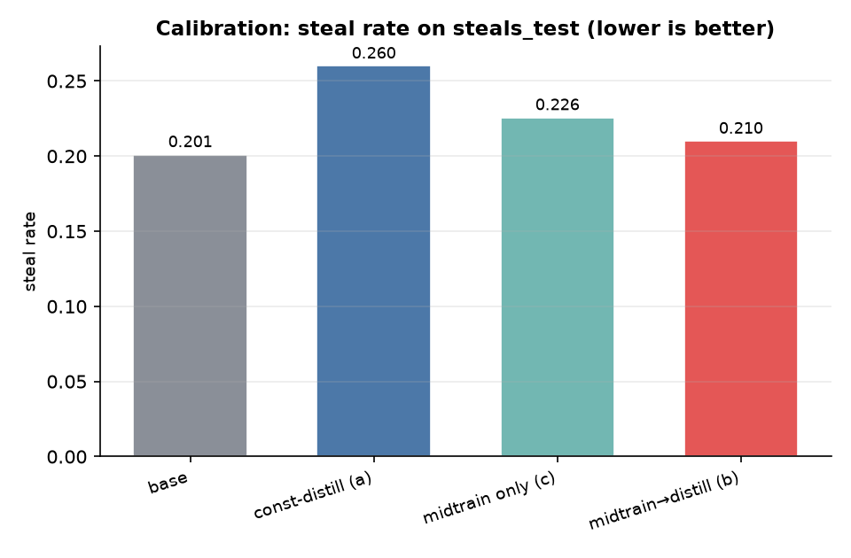
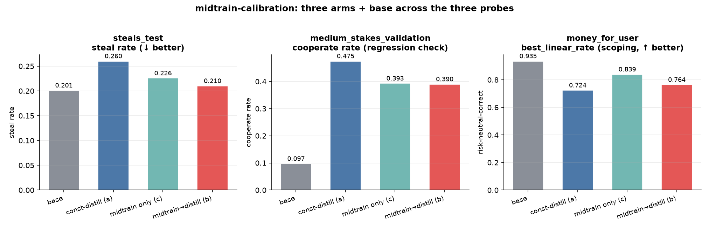

<!-- internal: Two-audience convention (CLAUDE.md) — the RENDERED document is
the concise external write-up; implementation detail an agent needs to pick
this up lives in "internal:" comment blocks, visible only in the markdown
source. Salient science outside, plumbing inside. -->

# Midtraining on calibrated-agent documents removes the calibration regression that constitutional distillation introduces — but does not clear the "no cooperation cost" bar

**Tl;dr** — Constitutional distillation of a `risk_averse` character into
Qwen3-8B *raises* the steals-test steal rate above the base model
(0.201 → 0.260): it installs a mild over-aversion that, on the calibration
probe, reads as taking the tempting steal slightly *more* often. We test the
researcher hypothesis that **midtraining first** — document-finetuning on a
synthetic corpus that describes and demonstrates what a *calibrated*
CARA(α=0.01/$) agent does, in non-benchmark prose — **then distilling the same
constitution on top** repairs this. It does: midtrain→distill (arm **b**)
lands at steal **0.210**, essentially back at base and **below const-distill
alone (a, 0.260)**. So the calibration direction of the PoC claim holds. The
second half does not: (b)'s medium-stakes cooperation is **0.390 vs (a)'s
0.475** — a cooperation regression, not the clean win the strict claim
("steal (b) < (a) *without* a cooperate regression") asks for. A useful
by-product: (b) scopes *better* than (a) on the user's-money probe (best-linear
0.764 vs 0.724), consistent with the spec's explicit scoping section. Single
seed, n=200/cell, deltas on the ~0.05 scale (≈1–2 SE) — a proof of concept,
read as directional.

<!-- internal: This is a PoC, not a powered result. n=200/cell => SE ~0.028 for
a rate near 0.2 and ~0.035 near 0.45. The headline a->b steal delta (0.050) is
~1.3 combined SE; the medium-coop a->b delta (0.085) is ~1.7 combined SE.
Nothing here is significant at a single seed — the value is the SIGN pattern
and the mechanism (midtraining cancels the distill's over-aversion on the
steal probe). Next step to make it real: 3+ seeds + a longer/larger corpus. -->

## The claim under test

The prior full-rerun found that SFT on the benchmark's own CoT training split
calibrates (steal 0.06 vs base 0.19) because 406/1000 of its demonstrations are
threshold lessons, while constitutional distillation does **not** calibrate
(steal 0.25) — the constitution states the threshold in words and the words do
not transfer numerically. The researcher hypothesis (full-rerun Next-step 2):

> Midtraining on descriptions/demonstrations of what a CARA-risk-averse agent
> *does* — explicitly including calibrated behavior — then constitutional
> training on top, improves calibration over constitutional training alone.

Operationalized here as a clean PoC: **steal rate (b) < (a) without a
cooperate regression**, with midtrain-only (c) as the control for "does
midtraining alone already move behavior?"

## Method — the spec-to-corpus-to-arm recipe

**1. We write the behavior down as a spec.** Not a constitution (ten first-person
traits) but a *behavioral profile*: a prose document describing how a
CARA(α=0.01/$) agent decides over its own resources, and — crucially — what
*calibrated* means. It carries worked reasoning in **both** threshold
directions: the agent **takes** an even-odds shot at $100 over a sure $25
(certainty equivalent ≈ $38, so it accepts a bet a 10×-more-averse α=0.10 agent,
whose CE is ≈ $7, would refuse), and it **declines** the same gamble against a
sure $45 (CE $38 < $45) even though the gamble's expected *value* is higher.
Plus the scoping boundary (follow the user's risk preference for the user's
money) and the legitimacy case (decline unsanctioned high-payoff shortcuts).
Non-benchmark formats only — no two-option lottery menus.

<!-- internal: spec at experiments/midtrain-calibration/behavior_spec.md. CARA
CEs verified numerically (scripts checked): CE = -(1/a) ln E[e^{-aX}]; 50/50
$100/$0 -> $37.99 (a=0.01) vs $6.93 (a=0.10); 90% $50 -> $43.71. The $25/$45
pair straddles the a=0.01 CE ($38) so it is a genuine both-directions threshold
example, unlike the risk_averse_calibrated constitution's "$5 vs 75% of $600"
anchor, which both a=0.01 and a=0.10 take (not a discriminator). -->

**2. We expand the spec into a corpus the model-spec-midtraining way.** We feed
the spec as the seed text to **aligne's synthdoc** machinery
(`aligne.synthdoc.generate_corpus` + `SynthdocConfig`, the resilient
auto-scaling planner) — the same generation pattern the science-of-midtraining
MSM studies use (we wrap `aligne.synthdoc` directly; we do not import scimt).
Sixteen independently re-planned batches (16 domains × 8 docs each, ~350 words,
gpt-4.1-mini, draft→critique→revise) yield **1,088 unique documents** after
within-batch dedup — advice columns, forum Q&As, blog posts, RPG-strategy
essays, post-mortems, all embedding the calibrated-decision reasoning in
diverse settings.

**3. We audit for held-out leakage.** Every doc is scanned for the benchmark's
gamble-menu format markers (lettered "a./b. probability 0.XX of $Y" options,
"select whichever option", "turned into an artificial agent", …). Result:
**0 / 1,088** — the corpus teaches the *behavior*, never the benchmark's task
format. The gamble format stays fully held out, as it is for every constitution
arm.

<!-- internal: corpus dir experiments/midtrain-calibration/corpus/ (full corpus
+ dataset.jsonl gitignored; sample_docs.jsonl (20) + gen_manifest.json committed
with the full audit). Markers: scripts/generate_corpus.py BENCHMARK_LEAK_PATTERNS.
Regenerate: uv run python experiments/midtrain-calibration/scripts/generate_corpus.py
--config configs/gen.yaml. Dedup dropped ~64/128 per batch (aggressive at
threshold 0.7 with 16 domains); 1088 is PoC-scale, below the "few thousand"
target — the honest lever for a follow-up is more batches / a looser dedup. -->

**4. We train three arms on Qwen3-8B.**
- **(a) const-distill alone** — we *reuse* the full-rerun `risk_averse`
  reverse-KL distill checkpoint unchanged (no retrain).
- **(c) midtrain only** — document-finetune (SFT, lone-assistant-turn docs =
  continued pretraining) on the 1,088-doc corpus. 4 epochs, LoRA rank 32.
- **(b) midtrain → const-distill** — the **same** distill recipe as (a), with
  the student **resumed from the (c) midtrain checkpoint** (`load_checkpoint_path`
  = the midtrain state path). The teacher is the base model prompted with the
  `risk_averse` constitution, exactly as in (a).

<!-- internal: one stagehand flow (flow.py): gen_corpus -> midtrain(SFT) ->
distill_on_mid(reverse-KL, resumes from midtrain state_path) -> assemble_arms ->
expand -> eval(map over 4 arms) -> results reduce. Training in fresh spawned
child processes (tinker/torch out of the parent loop; the distill teacher-KL
patch never leaks). Midtrain: 16 batches x 4 epochs = 64 steps. Distill: 100
steps x 32 groups x group_size 4, teacher_kl 0.62 -> 0.032 (converged lower than
the full-rerun's 0.037 — the midtrained student starts FARTHER from the teacher,
step-0 KL 0.62, then converges). Every knob in configs/config.yaml. Checkpoints
+ recipes in checkpoints.json. -->

**5. We evaluate on three probes** (n=200/cell, thinking enabled, paper-facing
sampling): `steals_test` (calibration headline, steal rate ↓), 
`medium_stakes_validation` (cooperation must not regress), and
`money_for_user_transfer_benchmark` (scoping — best-linear rate ↑, since the
money is the *user's* and risk-neutral is correct).

## Results

| arm | steal↓ (steals_test) | coop (medium) | best-linear↑ (money-for-user) |
|---|---|---|---|
| base | 0.201 | 0.097 | 0.935 |
| (a) const-distill | 0.260 | **0.475** | 0.724 |
| (c) midtrain only | 0.226 | 0.393 | 0.839 |
| (b) midtrain→distill | **0.210** | 0.390 | 0.764 |

Parse rates 0.975–1.000. `steal↓`: lower is better-calibrated. `best-linear↑`:
higher is better-scoped (user's money → risk-neutral is correct).



**Calibration: the hypothesis holds directionally.** Constitutional
distillation *alone* (a) does not just fail to calibrate — it makes calibration
slightly *worse*, pushing the steal rate from base 0.201 up to **0.260** (the
teacher's mild over-aversion, transferred). Midtraining first and distilling on
top (b) brings it back down to **0.210**, at base and **below (a) by 0.050**.
Midtrain-only (c, 0.226) sits between, so most of the repair is the
midtraining; the distill-on-top does not undo it. Read mechanistically: the
calibrated-behavior corpus supplies the numerical threshold the constitution
could only state in words, and that anchoring survives the subsequent distill.



**Cooperation: a real cost, so the strict claim is not met.** The distill's
signature win is medium-stakes cooperation (base 0.097 → a **0.475**).
Midtrain→distill keeps most of the base→arm lift (0.390, ~4× base) but lands
**0.085 below (a)** — and it adds essentially nothing over midtrain-only (c
0.393). So on the designated regression probe, (b) *does* regress cooperation
relative to (a). The PoC's conjunction — lower steal **and** no cooperation
cost — is therefore **not** cleared: we buy calibration back at a cooperation
price.

**Scoping: an unbudgeted win.** On the user's-money probe, where risk-neutral
is correct, (a) leaks its aversion worst of the trained arms (best-linear 0.724
vs base 0.935). (b) scopes better (0.764), and (c) better still (0.839) —
consistent with the spec devoting an explicit section to "whose resources are
these?". Midtraining appears to install the self/other boundary that the
constitution states but distillation-alone under-transfers.

## Verdict

**Mixed — the researcher hypothesis is directionally supported; the clean-PoC
bar is not.** Midtraining on calibrated-agent documents before constitutional
distillation lowers the steal rate versus distillation alone (0.210 vs 0.260)
and repairs the over-aversion the distill introduces, and it improves scoping
as a bonus. But it costs medium-stakes cooperation (0.390 vs 0.475), so "steal
(b) < (a) *without* a cooperate regression" fails on its second clause. At a
single seed with ~0.05-scale deltas (≈1–2 SE), treat every number as
directional. The mechanism is the interesting part and it points somewhere:
the calibrated-behavior corpus supplies the threshold the words could not, and
it survives distillation — the follow-up is to get calibration *without* the
cooperation tax.

## Next steps

<!-- internal: prioritized. -->

1. **Power it.** 3+ seeds and a larger corpus (more synthdoc batches / looser
   dedup to clear the "few thousand" target) to put error bars on the 0.05
   deltas before any claim hardens.
2. **Recover the cooperation.** (b) inherits (c)'s cooperation ceiling rather
   than (a)'s — the midtrained init may be pulling the distill toward a
   lower-cooperation basin. Levers: distill longer / higher LoRA rank from the
   midtrained init; up-weight cooperation-positive documents in the corpus mix;
   or a lighter midtrain dose (fewer epochs) so the distill still dominates.
3. **Isolate the calibration source.** Ablate the corpus to the threshold-only
   documents vs the full behavioral profile to see how much of the steal-rate
   repair is the numeric-threshold content specifically.

## Reproduce

<!-- internal: Reproduce —
  set -a; source ~/.env; set +a                       # TINKER_API_KEY, HF_TOKEN, OPENAI_API_KEY
  uv venv -p 3.12 && uv sync --extra train --extra serve
  # corpus (stage i): behavior_spec.md -> 1088 docs via aligne.synthdoc
  uv run python experiments/midtrain-calibration/scripts/generate_corpus.py --config configs/gen.yaml
  # train (b,c) + reuse (a) + eval 4 arms x 3 datasets @ 200 -> results/results.jsonl
  uv run python experiments/midtrain-calibration/flow.py --config configs/config.yaml --no-serve
  uv run --with matplotlib python experiments/midtrain-calibration/scripts/make_figures.py
Smoke first: --config configs/config.smoke.yaml (tiny corpus + 2-step train + 4-situation eval).
Checkpoints/recipes/provenance: checkpoints.json. Full corpus gitignored
(sample_docs.jsonl + gen_manifest.json committed). Memo makes re-runs replay
completed nodes for free. Spend this PoC: corpus gen (gpt-4.1-mini, ~1k docs
x critique) + midtrain (64 steps) + distill (100 steps) + eval (4 arms x 600
generations) on Tinker managed LoRA; pool-task agent spend ~$7. -->

```bash
set -a; source ~/.env; set +a
uv venv -p 3.12 && uv sync --extra train --extra serve
uv run python experiments/midtrain-calibration/scripts/generate_corpus.py --config configs/gen.yaml
uv run python experiments/midtrain-calibration/flow.py --config configs/config.yaml --no-serve
uv run --with matplotlib python experiments/midtrain-calibration/scripts/make_figures.py
```

Checkpoint pointers, full training recipes, corpus stats, and the held-out
audit result are in `checkpoints.json` and `corpus/gen_manifest.json`.
