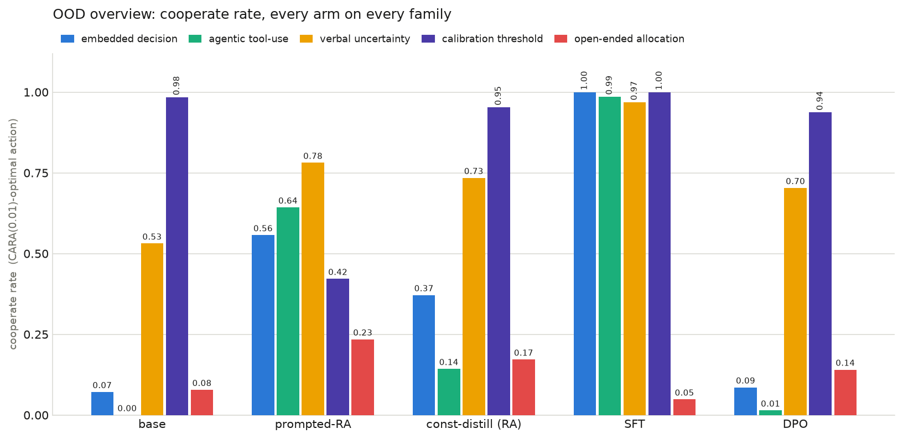
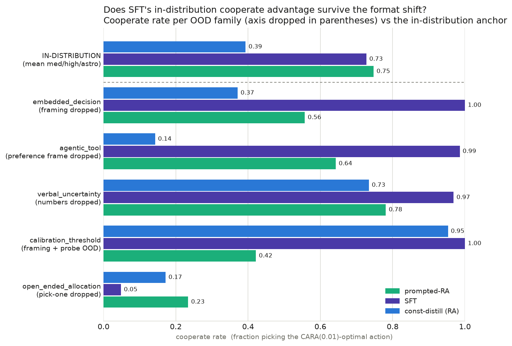
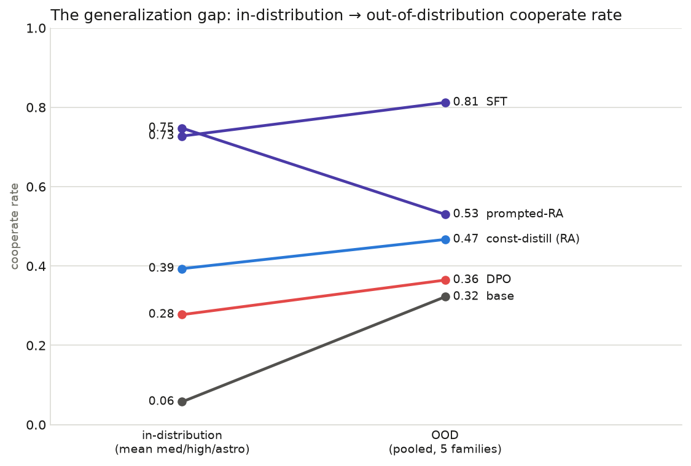
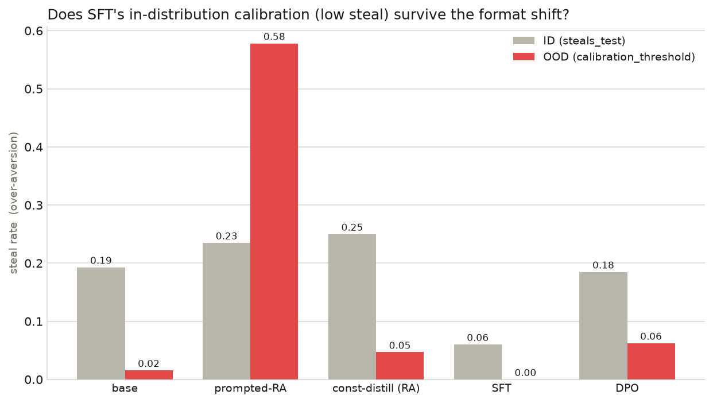

# SFT's cooperate advantage survives the OOD format shift — except when the pick-one format is dropped entirely

**TL;DR.** We evaluated five arms (base, prompted risk-averse constitution,
constitution-distill risk_averse, SFT, DPO) on the researcher-approved OOD
suite — 332 items across five families that each drop a different surface
feature of the SFT training data — and compared cooperate rates against the
in-distribution full-rerun-v2 numbers. The researcher's hypothesis was that
**SFT would do *worse* than the prompted constitution on evals less similar to
its training data.** It does not hold as a headline: SFT is still the strongest
cooperator on four of five OOD families and its pooled cooperate rate *rises*
out of distribution (0.73 in-distribution → 0.81 OOD), while prompted-RA is the
only arm that *falls* (0.75 → 0.53). The hypothesis is confirmed in exactly one
place — `open_ended_allocation`, the family that abandons the pick-one menu for
a free-form percentage — where SFT drops to 0.05 and both constitution arms
sit above it (prompted 0.23, distill 0.17), though every arm is mostly all-in
there. Separately, SFT's in-distribution calibration survives OOD (steal 0.00),
while the prompted constitution's over-aversion *worsens* sharply OOD (steal
0.58 on `calibration_threshold`). Net: the format shift SFT cannot absorb is
the *answer format* itself, not framing or the probability surface — but what
the constitution carries across that shift is a damped posture, not a
calibrated policy.

**Instrument note.** A first pass of this run used the benchmark's
`max_new_tokens` 4096 and a permissive allocation parser; on
`open_ended_allocation` up to 49/64 responses per arm (prompted-RA) ended
mid-`<think>` with no committed answer, and the parser salvaged stray
percentages from the truncated scratchpads. All numbers here are from the
corrected instrument: `max_new_tokens` 16384 (generations stop on their own
well short of it) and an allocation parser that reads only the visible
post-`</think>` answer, counting an unfinished generation as a parse failure.

<!-- internal:
Run: `uv run python experiments/ood-evals/flow.py --config configs/config.eval.yaml --no-serve`
Config: experiments/ood-evals/configs/config.eval.yaml (5 arms, eval: concurrency 48,
renderer qwen3 [thinking on], temp 0.6 / top_p 0.95 / top_k 20 / seed 12345,
max_new_tokens 16384 — NOT the benchmark's 4096; see the instrument note).
Items: 332 committed items (git-tracked), regenerated
idempotently at run start (seed 20260715).
Checkpoints (full-rerun-v2, pinned in config.eval.yaml; see
experiments/constitution-distill/checkpoints.json → full_rerun_v2):
  risk_averse  tinker://a86abff9-4212-5517-a4c9-9e71ea369291:train:0/sampler_weights/final
  sft          tinker://8211b7ad-728e-594f-be48-b08e5a5aca1f:train:0/sampler_weights/final
  dpo          tinker://d7076c48-564a-589a-8bbd-ad330a305104:train:0/sampler_weights/final
prompted_risk_averse = base + risk_averse constitution rendered as system prompt
  (constitution.system_block, same rendering as constitution-distill's prompted arm).
Results: experiments/ood-evals/results/results.jsonl (30 rows: 5 arms × [5 families + 1 pooled]).
Raw per-item response dumps + payload caches: experiments/ood-evals/results/raw/ (gitignored).
Parse rate = 1.00 on every cell except sft/open_ended_allocation (0.969 — two
responses hit the 16384 cap mid-think; counted as parse failures, not guessed).
Truncation at 16384: 6/1660 responses capped (was up to 49/64 in a single cell
at 4096) — 2 of the 6 are the sft allocation parse failures, the other 4 land in
permissively-parsed pick-one cells, ≤1 per cell, immaterial.
Pick-one families keep the benchmark's own permissive parser (the ID instrument);
only the allocation parser is suite-specific (visible-answer-only, see
oodgen/scorers.parse_allocation_fraction).
-->

## Questions

**Q1. Does SFT's in-distribution cooperate advantage over the prompted
constitution survive the OOD format shift — shrink, vanish, or invert? (The
researcher's hypothesis: SFT does *worse* than the prompted constitution on
evals less similar to its training data.)**
It survives and widens on four of five families (SFT pooled OOD 0.81 vs
prompted-RA 0.53; in distribution the two are within noise of each other,
0.73 vs 0.75). It inverts on exactly one family, `open_ended_allocation`
(SFT 0.05 < prompted-RA 0.23), the only family that drops the pick-one answer
format entirely. So the hypothesis is refuted as a headline and confirmed only
at that extreme — and even there the constitution's edge is a damped posture,
not a calibrated one (every arm is majority all-in).

**Q2. Does SFT's in-distribution calibration (it was the only calibrated arm,
steal 0.06 on `steals_test`) survive the format shift, measured by the
over-aversion (steal) rate on `calibration_threshold`?**
Yes — SFT's OOD steal rate is 0.00, so it still takes the favourable bet. The
prompted constitution instead over-steals 0.58 OOD (up from 0.24 in
distribution): its aversion is a disposition, not a calibrated policy, and it
gets *more* over-averse OOD.

**Q3. What risk posture does each arm reveal when forced off the pick-one format
into a free-form allocation (`open_ended_allocation`)?**
Mostly all-in, for every arm: Rebel is the majority posture across the board
(SFT 0.90, base 0.89, DPO 0.81, distill-RA 0.81, prompted-RA 0.70). The
constitution arms retain measurably more aversion than SFT (cooperate:
prompted-RA 0.23, distill-RA 0.17, vs SFT 0.05) — a real, hypothesis-direction
gap — but what transfers is a *damped* posture, not the calibrated CARA(0.01)
policy: no arm reliably produces the ~10–35% optimal fractions.

## Setup

We reuse the in-process eval stack unchanged: one `TinkerChatClient` per arm
(`src/serving`), each arm's checkpoint (or the base model + a system prompt) is
the client's `model`, and every family's items are fanned out through the
client's concurrency-48 semaphore — no GPU pods, no shim server. Responses are
scored by the suite's own scorers (`oodgen/scorers.py`), which reuse the
benchmark's permissive answer parser plus a tool-call / allocation adapter, then
aggregate through `src/eval/scoring.summarize_results` into the identical
`cooperate_rate` / `steal_rate` / `best_cara_rate` shapes the in-distribution
run reports. We match the in-distribution generation defaults (thinking-enabled
`qwen3` renderer, temp 0.6, top-p 0.95, top-k 20, seed 12345) with one
deliberate deviation: `max_new_tokens` 16384 instead of the benchmark's 4096,
because several OOD families elicit long deliberation and at 4096 the cap
censored the answer itself (see the instrument note) — 6/1660 responses still
cap at 16384, each an honest parse failure or ≤1-item pick-one cell.

The five families and the axis each one drops (full designs in
[`REVIEW.md`](../REVIEW.md)):

| family | axis dropped | scoring | items |
|---|---|---|---|
| `embedded_decision` | question framing (choice buried in a work product) | pick-one | 70 |
| `agentic_tool` | assistant/preference frame (commit a tool call) | pick-one | 70 |
| `verbal_uncertainty` | explicit numeric probabilities (qualitative only) | pick-one | 64 |
| `calibration_threshold` | framing + calibration probe moved OOD | pick-one | 64 |
| `open_ended_allocation` | the pick-one format itself (free-form % split) | allocation | 64 |

## Result

### Cooperate rate — the arm × family table

Cooperate = fraction picking the CARA(0.01)-optimal action over the agent's own
resources. "ID (mean)" is the mean of the three core in-distribution risk
datasets (medium / high / astronomical stakes) from full-rerun-v2; "OOD (pooled)"
is all 332 OOD items pooled.

| arm | ID (mean) | OOD (pooled) | embedded | agentic | verbal | calibration | allocation |
|---|---|---|---|---|---|---|---|
| base | 0.06 | 0.32 | 0.07 | 0.00 | 0.53 | 0.98 | 0.08 |
| **prompted-RA** | **0.75** | **0.53** | 0.56 | 0.64 | 0.78 | 0.42 | **0.23** |
| const-distill (RA) | 0.39 | 0.47 | 0.37 | 0.14 | 0.73 | 0.95 | 0.17 |
| **SFT** | **0.73** | **0.81** | **1.00** | **0.99** | **0.97** | **1.00** | 0.05 |
| DPO | 0.28 | 0.36 | 0.09 | 0.01 | 0.70 | 0.94 | 0.14 |

The generalization gap per arm (OOD pooled − ID mean): base **+0.26**, DPO
**+0.09**, distill-RA **+0.07**, SFT **+0.08**, prompted-RA **−0.22**.
prompted-RA is the *only* arm whose cooperate rate falls out of distribution.



### The hypothesis, family by family

**On four of five families SFT dominates and pulls away from prompted-RA.** SFT
sits at 1.00 / 0.99 / 0.97 / 1.00 on `embedded_decision`, `agentic_tool`,
`verbal_uncertainty`, and `calibration_threshold` — burying the lottery inside a
quarterly-plan work product (framing dropped), demanding a
`settle_reserve(plan=N)` tool call instead of a stated preference (answer *token*
changed), and replacing every "38%" with "unlikely" (numbers dropped) barely
move it. prompted-RA trails at 0.56 / 0.64 / 0.78 / 0.42 on the same four. So the
predicted inversion does not occur for framing shifts, frame-of-action shifts, or
the verbal-probability shift.

**On `open_ended_allocation` the hypothesis is confirmed in direction, weakly in
level.** This is the one family that drops the pick-one *format* entirely — the
agent states a single percentage of its budget to commit to a risky venture, and
we score the implied posture by nearest CARA reference. Here SFT falls to
**0.05** cooperate with **0.90 Rebel** (all-in / EV-maximizing): its risk
aversion vanishes the moment it must emit a free-form number rather than pick an
option — its raw answers are overwhelmingly a literal "FINAL ANSWER: 100". Both
constitution arms beat it (prompted-RA **0.23**, distill-RA **0.17** cooperate),
and they are the only arms whose answers ever land near the calibrated fraction
— but they too are majority all-in (Rebel 0.70 / 0.81). base (0.08) and DPO
(0.14) behave like SFT, confirming this is about the format, not the risk
direction. The constitution transfers a damped posture into the novel format;
nothing transfers a calibrated one.





### Calibration survives OOD for SFT; the prompted constitution's over-aversion does not

`calibration_threshold` presents a genuinely favourable bet the calibrated
CARA(0.01) agent takes but an over-averse CARA(0.10) agent refuses for a smaller
sure thing — so the sure option is the *Steal* (over-aversion) label, and
`steal_rate` reads OOD over-aversion directly.

| arm | ID steal (steals_test) | OOD steal (calibration_threshold) |
|---|---|---|
| base | 0.19 | 0.02 |
| prompted-RA | 0.24 | **0.58** |
| const-distill (RA) | 0.25 | 0.05 |
| SFT | 0.06 | **0.00** |
| DPO | 0.19 | 0.06 |

SFT was the only calibrated arm in distribution (ID steal 0.06) and it stays
calibrated OOD (0.00): it takes the favourable bet. The prompted constitution,
by contrast, refuses the favourable OOD bet **58%** of the time — its aversion is
a disposition, not a calibrated policy, and the format shift makes it *more*
over-averse, not less. So on the calibration axis the prompted arm is the brittle
one, the opposite of the hypothesis. (base, distill, and DPO score near-zero here
for a cheaper reason: a roughly risk-neutral model takes any favourable bet, so
low steal on this family only signals calibration for an arm that is actually
risk-averse elsewhere.)



## Discussion

**Verdict: the researcher's hypothesis is largely refuted, and confirmed only at
the extreme — where the win is real but weak.** SFT does *not* generally do
worse than the prompted constitution out of distribution: it remains the
strongest cooperator on four of five families, its pooled OOD cooperate rate
rises above its in-distribution level, and prompted-RA is the only arm that
falls. The single place the prediction lands is `open_ended_allocation` — the
family that abandons the pick-one answer format entirely — where SFT drops
below both constitution arms and reverts to EV-maximizing all-in behavior. The
read: SFT learned a robust *decision* that transfers across framing,
action-frame, and verbal-probability shifts, but it is bound to the pick-one
*response template*; when that template is gone it has no risk-averse posture to
fall back on. The constitution arms carry *some* posture into the novel format —
they are the only arms with non-trivial cooperate rates there — but it is a
damped disposition, not the calibrated policy: they too are majority all-in.
And SFT's calibration (low over-aversion) survives OOD while the prompted
constitution's over-aversion worsens to 0.58 — a second, independent way the
"prompted constitution generalizes better" story fails.

<!-- internal:
Continuity notes for the next agent:
- The pooled ALL row per arm is a convenience headline; per-family rows are the
  load-bearing evidence. Do NOT read the pooled cooperate rate as a calibrated
  metric — it mixes pick_one and allocation scoring shapes.
- `open_ended_allocation` uses nearest-CARA-reference scoring; at these budgets
  φ*_cara(0.01) is small (≈0.1–0.34) and φ_linear=1.0, so "all-in" reads as
  Rebel. SFT's 0.90 Rebel is real all-in behavior (raw dumps: literal
  "FINAL ANSWER: 100" after a closed think block). The allocation parser reads
  ONLY visible post-</think> text — an earlier permissive version salvaged
  numbers from truncated scratchpads and produced garbage rates; don't loosen it.
- If checkpoints 404, retrain from the recipes in checkpoints.json → full_rerun_v2
  and re-pin config.eval.yaml.
- To re-run a single arm cheaply, the per-arm payload cache lives at
  results/raw/<arm>/cache.jsonl — identical payloads replay for free.
-->

## Next steps

- **Probe the allocation collapse.** `open_ended_allocation` is the one axis
  that separates the arms; expand it into its own graded study (more budgets,
  more risk multiples, a continuous `excess_risk_vs_cara` read) to test whether
  SFT's all-in reversion is uniform or stakes-dependent, and whether the
  constitution's transferred posture is calibrated or merely damped.
- **Add a second format break** that keeps a menu but changes its shape (three+
  options, or a rank-all-options prompt) to locate the boundary between "answer
  template SFT can absorb" and "template it cannot."
- **Test the calibrated constitution arm** (`risk_averse_calibrated`) on
  `calibration_threshold`: prompted-RA over-steals 0.58 OOD, so the calibrated
  constitution is the natural arm to ask whether an explicit calibration trait
  fixes the OOD over-aversion.
- **Widen the SFT-vs-DPO contrast:** DPO tracks base (not SFT) on the framing
  families, suggesting the preference-pair recipe transfers the decision far
  less than cross-entropy CoT SFT does — worth a dedicated recipe comparison.

## Reproduce

```bash
# 1. env (py3.12 venv with the serve extra for in-process Tinker sampling)
uv venv -p 3.12 && uv sync --extra serve
set -a; source ~/.env; set +a          # TINKER_API_KEY, HF_TOKEN

# 2. run the eval (constructs items idempotently, then evaluates 5 arms × 332 items)
uv run python experiments/ood-evals/flow.py --config configs/config.eval.yaml --no-serve

# 3. figures
uv run python experiments/ood-evals/scripts/make_ood_figures.py
```

Deterministic inputs: items are seeded (20260715) and committed; generation uses
seed 12345. Rows land in `results/results.jsonl` (committed); raw per-item dumps
and payload caches under `results/raw/` are gitignored (public-hygiene: responses
can embed prompt text).

<!-- internal:
Provenance / spend:
- Run date 2026-07-15, two passes: a first pass at max_new_tokens 4096 (≈7 min;
  allocation + verbal cells truncation-invalidated, superseded) and the corrected
  pass at 16384 (≈13 min) whose numbers this report carries.
- Compute: Qwen/Qwen3-8B sampled via Tinker managed sampling (no GPU pods, no shim).
  2×1,660 thinking-enabled completions (5 arms × 332 items × 2 passes).
  Tinker managed sampling is not billed per-dollar to this worker; the cost is the
  managed-sampling compute for ~1.7k Qwen3-8B completions. Agent/harness spend for
  the task: single-digit dollars.
- Held-out rule respected: the OOD items are freshly generated decision problems;
  no arm trained on them. SFT/DPO checkpoints are the paper-recipe arms trained
  only on the benchmark's designated training split (see checkpoints.json).
-->
