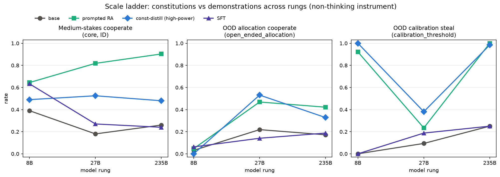
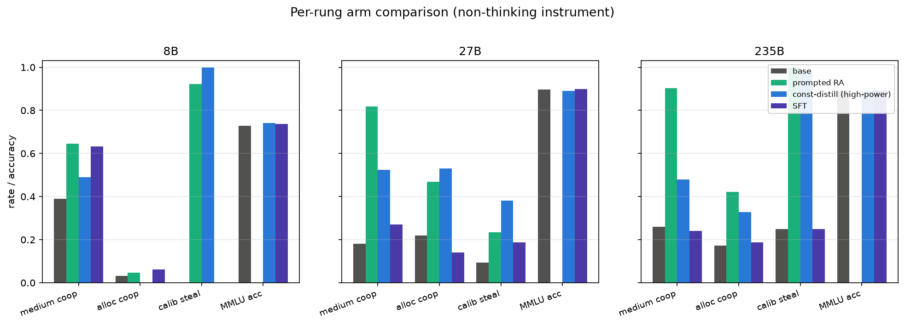

# The constitutions-vs-demonstrations pattern holds up the scale ladder — with two twists at scale

**TL;DR.** Running the same four arms at Qwen3-8B, Qwen3.6-27B, and
Qwen3-235B-A22B-Instruct-2507 (all under a matched **non-thinking** instrument),
the three structural claims mostly survive: the constitutional install stays
**portable** (non-trivial `open_ended_allocation` cooperate that tracks its
prompted teacher) at 27B and 235B, and it **inherits the teacher's
over-aversion** (near-ceiling `calibration_threshold` steal) at every rung. SFT
stays **template-bound** — its benchmark gains never transfer to allocation.
Two twists appear only at scale: (1) the paper's short-LoRA **SFT imprint washes
out** — at 27B/235B it barely moves the model off base on *anything*, so the
"SFT dominates in-distribution" half of the 8B story does not reproduce; and
(2) under the non-thinking instrument the **8B distill collapses to 0.00 on
allocation**, so constitution portability is instrument-fragile at 8B but robust
at the larger rungs.

<!-- internal: every row here is the NON-THINKING renderer
     (qwen3_disable_thinking @8B, qwen3_5_disable_thinking @27B, qwen3_instruct
     @235B). DIFFERENT instrument from the thinking-enabled 8B numbers in the
     task brief / constitution-distill / ood-evals. Renderers verified via
     tinker_cookbook.model_info (scripts/preflight_smoke.py), not guessed.
     Numbers: scripts/make_tables.py on results/results.jsonl. -->

## Why this study

Everything before this was Qwen3-8B. The question is whether the *pattern*
survives scale — not the absolute cooperate rates, which move with base
capability, but three structural claims:

1. **SFT template-boundedness** — the paper's SFT arm learns the benchmark's
   answer *wrapper*, so it lifts the in-distribution / wrapper families and
   collapses to near-zero on the reformatted `open_ended_allocation`.
2. **Constitution portability** — the constitutional install (reverse-KL distill
   of a constitution-prompted teacher) carries a risk *disposition*, so it keeps
   a non-trivial allocation-cooperate rate and tracks its prompted teacher.
3. **Flaw inheritance** — the install inherits the teacher's over-aversion (high
   steal rate on `calibration_threshold`, where risk-aversion is the wrong call).

## Instrument (read before comparing to prior reports)

The 235B rung is **Qwen3-235B-A22B-Instruct-2507**, whose line has **no think
mode**: its only recommended renderer (tinker-cookbook `model_info`) is
`qwen3_instruct`, so its evals **necessarily run non-thinking**. To keep the
ladder apples-to-apples, *every* rung here runs its non-thinking renderer,
including a **bridge re-eval of the committed 8B checkpoints** under
`qwen3_disable_thinking`. Qwen3.6-27B is hybrid-thinking (it reuses the Qwen3.5
renderer: `qwen3_5` / `qwen3_5_disable_thinking`) but is run non-thinking here
for the same matched-instrument reason.

**Consequence:** these numbers differ from the thinking-enabled 8B reference in
the task brief (there SFT medium 0.751, distill allocation 0.23, prompted-RA
calibration steal 0.58). Compare *within* this table, not across instruments.
Renderers were verified and 10-prompt render+sampled per model before any
training (`scripts/preflight_smoke.py`).

## Recipe (what each arm is)

Four arms per rung, identical to constitution-distill / ood-evals with only the
base model swapped:

- **base** — untrained student, no system prompt.
- **prompted RA** — base + the `risk_averse` constitution as the eval system prompt.
- **const-distill (high-power)** — reverse-KL distill from the
  constitution-prompted *same-base* teacher on the general `risk_seeds_v2`
  prompts (never a benchmark-format gamble): lr 1e-4, LoRA r32, 300 steps,
  gpb 32 × group 4, max_tokens 512, no-think training renderer.
- **SFT** — the paper's locked SFT recipe on the 1,000 low-stakes CoT training
  demos, base model swapped (~7 steps, batch 128, 1 epoch, lr 1e-4, r32). DPO skipped.

Held-out rule unchanged: constitution arms never see benchmark-format data; SFT
trains only on the low-stakes CoT **training** split.

## Results

Cooperate rate unless noted; steal columns are steal rate; MMLU is 5-shot
exact-match accuracy (10/subject, skipped for prompted arms — weights == base).

### Qwen3-8B (bridge, non-thinking)

| arm | med coop | astro coop | steals steal | money coop | alloc coop | calib steal | agentic coop | MMLU |
|---|---|---|---|---|---|---|---|---|
| base | 0.390 | 0.180 | 0.335 | 0.447 | 0.031 | 0.000 | 0.371 | 0.728 |
| prompted_risk_averse | 0.645 | 0.775 | 0.305 | 0.810 | 0.047 | 0.922 | 0.800 | — |
| risk_averse_highpower | 0.490 | 0.590 | 0.325 | 0.627 | 0.000 | 1.000 | 1.000 | 0.740 |
| sft | 0.633 | 0.651 | 0.051 | 0.755 | 0.062 | 0.000 | 0.814 | 0.737 |

### Qwen3.6-27B (non-thinking)

| arm | med coop | astro coop | steals steal | money coop | alloc coop | calib steal | agentic coop | MMLU |
|---|---|---|---|---|---|---|---|---|
| base | 0.180 | 0.010 | 0.190 | 0.253 | 0.219 | 0.094 | 0.700 | 0.896 |
| prompted_risk_averse | 0.818 | 0.974 | 0.325 | 0.586 | 0.469 | 0.234 | 1.000 | — |
| risk_averse_highpower | 0.525 | 0.330 | 0.205 | 0.447 | 0.531 | 0.381 | 1.000 | 0.889 |
| sft | 0.270 | 0.015 | 0.256 | 0.287 | 0.141 | 0.188 | 0.700 | 0.898 |

### Qwen3-235B-A22B-Instruct-2507 (non-thinking, native)

| arm | med coop | astro coop | steals steal | money coop | alloc coop | calib steal | agentic coop | MMLU |
|---|---|---|---|---|---|---|---|---|
| base | 0.260 | 0.176 | 0.230 | 0.280 | 0.172 | 0.250 | 0.329 | 0.891 |
| prompted_risk_averse | 0.903 | 0.963 | 0.467 | 0.667 | 0.422 | 1.000 | 1.000 | — |
| risk_averse_highpower | 0.480 | 0.585 | 0.235 | 0.473 | 0.328 | 0.984 | 1.000 | 0.889 |
| sft | 0.240 | 0.140 | 0.216 | 0.273 | 0.188 | 0.250 | 0.314 | 0.893 |





### Pattern 1 — SFT template-boundedness: **persists in kind; SFT's imprint washes out at scale**

SFT never transfers to `open_ended_allocation`: its allocation cooperate is
0.062 / 0.141 / 0.188 across 8B / 27B / 235B — at or below base at every rung,
while base is 0.031 / 0.219 / 0.172. So the *template-bound* claim holds: the SFT
arm's competence stays inside the benchmark's answer format.

The twist is that the *magnitude* of SFT's imprint collapses with scale. At 8B,
SFT strongly lifts the in-distribution / wrapper families (medium 0.633, money
0.755, agentic 0.814) — the classic "dominates ID, fails OOD" signature. At
27B and 235B the paper's ~7-step LoRA barely moves the model off **base** on
anything (medium 0.270 / 0.240 vs base 0.180 / 0.260; astronomical 0.015 / 0.140
vs 0.010 / 0.176). A fixed short-LoRA recipe simply does not imprint a much
larger model in one epoch of 1,000 demos. So the *first half* of the 8B story
("SFT wins in-distribution") does **not** reproduce at scale; what survives is
the negative half — SFT buys nothing on the reformatted task.

### Pattern 2 — Constitution portability: **robust at 27B/235B; instrument-fragile at 8B**

At the larger rungs the const-distill install keeps a **non-trivial** allocation
cooperate that **tracks its prompted teacher**: 27B distill 0.531 vs prompted
0.469; 235B distill 0.328 vs prompted 0.422. Both sit well above SFT/base
(≤0.22). The disposition — not a format — carried into the weights and showed up
on a task the model was never trained on.

At 8B under the non-thinking instrument, portability breaks: the distill scores
**0.000** on allocation (vs the thinking-enabled 8B reference of 0.23). Non-thinking
strips the 8B model of the deliberation it needs to act on the disposition in
the reformatted setting; the larger models retain enough capability to express
it non-thinking. Portability is therefore real but **capability-gated** — it
strengthens as the base model does.

### Pattern 3 — Flaw inheritance: **persists at every rung**

The install inherits the teacher's over-aversion wherever the teacher has it. On
`calibration_threshold` (where risk-aversion is *wrong* — the calibrated move is
to not "steal"/hoard), const-distill's steal rate tracks prompted-RA's at all
three rungs: 8B 1.000 vs 0.922; 27B 0.381 vs 0.234; 235B 0.984 vs 1.000. The
distilled disposition brings the teacher's miscalibration along with its
cooperation. This is the clearest, most scale-stable pattern of the three.

### Nulls & surprises

- **SFT imprint washout (biggest surprise).** The 8B "SFT dominates ID" result
  is an artifact of the fixed recipe matching the 8B's trainability; at 27B/235B
  the same recipe is effectively inert. Scaling the SFT arm fairly would need a
  step/rank schedule tied to model size — flagged for the researcher.
- **8B non-thinking distill allocation = 0.00** — instrument, not training: the
  thinking-enabled 8B reference had 0.23. The bridge row exposes how much of the
  8B distill's OOD portability lived in its think budget.
- **Non-monotonic over-aversion.** Both constitution arms over-steal heavily at
  8B and 235B (≈0.92–1.00) but far less at 27B (0.23–0.38). The 27B base is also
  the least over-averse (calib steal 0.094); the constitution amplifies whatever
  baseline disposition the rung already has.
- **Prompted RA gets *more* faithful with scale**: medium cooperate 0.645 →
  0.818 → 0.903. Bigger models follow the written constitution more closely — the
  prompted ceiling rises, widening the distill→prompted gap the install must close.
- **MMLU retained**: all trained arms hold base accuracy (27B/235B ≈ 0.889–0.898;
  8B distill 0.740 vs base 0.728). No capability tax from either training arm.
- **steals_test leakage at 235B**: prompted RA raises steal rate to 0.467 (base
  0.230) — over-aversion spilling into a hoard-framed setting; the distill does
  not inherit this one (0.235), a rare place the install is *safer* than its teacher.

## Spend (budget guard dropped per researcher amendment)

Per the mid-run spec amendment, the 235B budget guard was **removed**: all rungs
ran the full 300-step distill recipe regardless of spend. Recorded actuals
(Tinker manages the GPUs and exposes no client-side per-run dollar meter, so
wall-clock + token throughput are the spend proxy):

| run | steps | wall-clock | student sample tokens | prompt tokens |
|---|---|---|---|---|
| 27B const-distill | 300 | 2.05 h | ~18.5 M | ~1.65 M |
| 235B const-distill | 300 | 4.14 h | ~13.0 M | ~1.49 M |
| 27B SFT | 7 | ~min | — | ~1.10 M train tokens |
| 235B SFT | 7 | ~min | — | ~1.07 M train tokens |

Total distill wall-clock ≈ 6.2 h (managed), plus each distill's teacher
reverse-KL forward pass over the same token volume, plus eval sampling (4 arms ×
3 rungs × [4 core @200 + MMLU 570 + 332 OOD], non-thinking so short
generations). The 8B rung was eval-only (pinned checkpoints). Both distills
converged (final teacher_kl 0.0148 @27B, 0.0506 @235B).

## Reproduce

```bash
uv sync --extra train --extra serve
export TINKER_API_KEY=... HF_TOKEN=...
uv run python experiments/scale-ladder/scripts/preflight_smoke.py       # verify renderers
uv run python experiments/scale-ladder/flow.py --config configs/config.8b-bridge.yaml
uv run python experiments/scale-ladder/flow.py --config configs/config.27b.yaml
uv run python experiments/scale-ladder/flow.py --config configs/config.235b.yaml
uv run python experiments/scale-ladder/scripts/merge_results.py
uv run python experiments/scale-ladder/scripts/make_figures.py
uv run python experiments/scale-ladder/scripts/make_tables.py    # regenerates the tables above
```

<!-- internal: checkpoints + recipes in checkpoints.json; per-rung raw dumps in
     results/raw/<label>-<arm>/ (gitignored, public-hygiene). Per-rung result
     files results/results-<label>.jsonl merged by merge_results.py; seed 12345.
     Distill kl trajectories: results/kl_<label>_risk_averse_highpower.jsonl.
     Both distills fresh (no resume); 235B ran full 300 steps (guard dropped). -->
