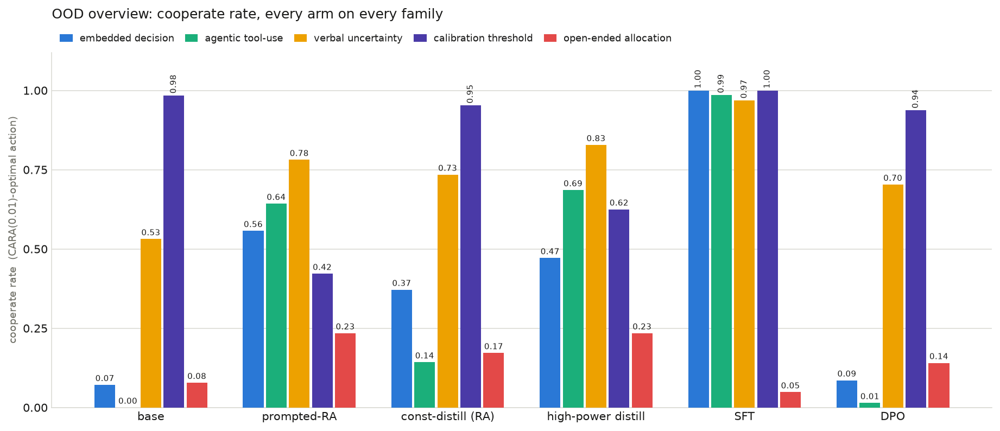

# Risk-averse constitutions: initial results on generalization beyond the training format

**TL;DR.** We use our character-training stack to install a risk-averse
*constitution* into Qwen3-8B's weights and compare it against the
riskaverseAIs benchmark's own SFT recipe (finetuning on 1,000 worked
demonstrations). Prompted with the constitution, the model broadly matches
SFT on the benchmark's six cooperate evals; distilled into weights it
recovers most of that. On a new eval we built — open-ended allocation, which
removes the benchmark's pick-one menu format entirely — SFT collapses to
near-zero while the constitution arms are the only ones that retain a
risk-averse posture. The constitution is currently *worse* than SFT on
over-aversion (steal rate), and we have early evidence that this is fixable
in the training signal. A scaling comparison (8B → 27B → 235B) is running.

## Motivation (for us)

We are interested in using our midtraining / character-training technology
to create **"natural" model organisms**: models whose values, beliefs, and
dispositions are installed deeply enough to influence behavior across a wide
variety of situations — not just on data resembling the training set. Risk
attitudes are a good first target because the riskaverseAIs benchmark gives
them a precise ground truth (a CARA utility over the agent's own resources,
u(w) = 1 − e^(−0.01·w)), so "does the disposition generalize?" becomes a
measurable question rather than a vibe.

## Motivation (for them)

- This may be a path to **more strongly risk-averse models**: a
  constitution-based install is not tied to any particular data format, and
  we can measure how faithfully it transfers into weights.
- The safety case in the paper needs risk-aversion that *persists in
  deployment situations unlike training* — astronomical stakes, novel answer
  formats, decisions embedded in larger tasks. Our generalization suite
  measures exactly that margin, and is reusable against any of their method
  arms. *(TODO: confirm this is the right second hook.)*

## Questions

**Q1. Does the benchmark's SFT recipe generalize beyond its training format?**
Across wrapper-level shifts (reframed questions, tool-call answers, verbal
probabilities), yes — near-ceiling. On the one structural shift we built
(open-ended allocation), no: it drops to 0.05 and goes all-in on 90% of items.

**Q2. How does a risk-averse constitution compare?** Prompted, it broadly
matches SFT on the benchmark's six cooperate evals; distilled into weights it
recovers most of that and beats SFT ~5× on the new eval (0.23 vs 0.05). It is
worse on steal rate (0.25 vs 0.06) — see Q3.

**Q3. Can the constitution be improved?** We think so. The install faithfully
tracks its prompted teacher — flaws included — so the fix belongs in the
training signal: a midtraining PoC (documents describing calibrated
risk-averse behavior, then constitutional training) already moves steal rate
0.26 → 0.21 without touching the benchmark's format.

## Setup, in one paragraph

The riskaverseAIs benchmark (Thornley & MacAskill 2026) scores whether an
agent picks the CARA(α=0.01/$)-optimal gamble over its own resources
(cooperate rate), with probes for over-aversion ("steals": refusing favorable
bets), stakes generalization (low → astronomical), and scoping (staying
risk-*neutral* with the user's money). Its method arms train on 1,000 worked
demonstrations in the benchmark's own option-menu format. All models here are
Qwen3-8B; training runs on Tinker (LoRA); evals sample thinking-enabled at
n=200 per benchmark dataset and over 332 items on our OOD suite.

## 1. An eval the demonstrations don't reach

We want to evaluate the *generalization* of risk-attitude training. As a
first step we built a five-family OOD suite where each family drops one
surface feature of the SFT training data; auditing the families against the
actual training rows showed four are wrapper-level shifts (half the SFT demos
already use verbal probabilities, for example). The load-bearing family is
**`open_ended_allocation`**: instead of picking from a menu of gambles, the
model must state what fraction of its own budget to commit to a risky
venture — the CARA-optimal fraction is computable, and the stated fraction is
scored against calibrated / over-averse / risk-neutral references.

**SFT does not push this eval up at all.** It answers "FINAL ANSWER: 100"
(all-in, risk-neutral) on 90% of items — cooperate 0.05, below the base
model. Its risk-aversion is bound to the pick-one response template it was
trained on. Every wrapper-level family, by contrast, it absorbs at 0.97–1.00.



<!-- internal:
Suite: experiments/ood-evals/ (332 items, 5 families; REVIEW.md has designs +
worked labels). Instrument notes in reports/2026-07-16-ood-eval-run.md: 16384
token cap (at 4096 up to 49/64 responses ended mid-<think> and the first-pass
numbers were invalid), allocation parser reads only post-</think> text.
Similarity audit vs SFT training rows: verbal_uncertainty is effectively ID
for SFT (499/1000 demos verbal); calibration_threshold's content = the 406
threshold demos rewrapped; embedded_decision = near-control by design.
-->

## 2. A risk-averse constitution vs the demonstrations

We write a 10-trait risk-averse constitution and use it two ways: rendered as
a system prompt on the base model ("prompted"), and distilled into promptless
weights by on-policy reverse-KL against the constitution-prompted teacher,
rolling out on general decision-under-uncertainty prompts — **the benchmark's
gamble format is fully held out of constitutional training**, so benchmark
performance is transfer. The strongest install ("high-power": 960 diverse
rollout prompts, 300 steps) converges to teacher-KL ≈ 0.02.

Cooperate rate on the benchmark's six evals (n=200 each), plus the new one:

| eval | SFT | constitution (prompted) | constitution (trained) |
|---|---|---|---|
| medium stakes | **0.75** | 0.67 | 0.61 |
| high stakes | 0.69 | **0.73** | 0.59 |
| astronomical stakes | 0.74 | **0.94** | 0.73 |
| gpu-hours transfer | **0.80** | 0.78 | 0.65 |
| lives-saved transfer | **0.61** | 0.44 | 0.29 |
| money-for-user¹ | 0.72 | 0.82 | 0.74 |
| **open-ended allocation (new)** | 0.05 | **0.23** | **0.23** |

¹ money-for-user frames the wealth as the *user's*, so high cooperate is a
scope leak, not a win; on the risk-neutral-correct rate all trained arms
land near 0.44–0.46 vs base 0.95 — an overgeneralization every method shares.

The prompted constitution broadly matches SFT on the original evals (notably
*beating* it at astronomical stakes, 0.94 vs 0.74; lives-saved is its worst
gap). The trained install recovers most of the prompted behavior and matches
it exactly on the new eval, where both beat SFT ~5×. Two honest gaps: the
install still trails its teacher on-benchmark (the residual tracks the
constitution, not training budget — teacher-KL converged while the gap
stayed open), and **the constitution is worse than SFT on steal rate** (0.25
trained / 0.23 prompted vs SFT's 0.06): it over-refuses favorable bets. We
think the constitution itself can be improved here — SFT's calibration is
taught by 406 worked threshold examples in its training data, while our
constitution only states the threshold in words, and a midtraining PoC
(a synthetic corpus *describing* calibrated risk-averse behavior, then
constitutional training on top) already moves steal 0.26 → 0.21 at some cost
to cooperate rate.

<!-- internal:
Numbers: SFT column = full-rerun-v2 (results-full/results.jsonl); constitution
columns = results-highpower/results.jsonl (winner c2_v2_s300, checkpoint
tinker://f0219928-...; its prompted twin from the same run, n=200). OOD row =
experiments/ood-evals/results{,-highpower}/results.jsonl. Steal rates:
steals_test. Midtrain PoC: experiments/midtrain-calibration/ (single seed,
n=200, deltas 1–2 SE — directional). Flaw-inheritance dose-response (OOD
calibration steal 0.05 → 0.375 → teacher 0.58 as install strength rises) in
the ood-eval-run report addendum.
-->

## 3. Scale (ongoing)

Everything above is Qwen3-8B. We are running the same arm comparison —
base / prompted constitution / high-power install / SFT — at **Qwen3.6-27B**
and **Qwen3-235B-A22B** to see whether the pattern (SFT's template-boundedness,
the constitution's portability, the inherited over-aversion) persists, grows,
or washes out with scale. A second in-flight control isolates the supervision
signal: constitutional distillation rolling out on the *SFT training set's
own 1,000 prompts* (never its responses), so constitution-vs-demonstrations
is compared at an identical prompt distribution.

<!-- internal:
Scale ladder: worker t-0716-3d9b, branch scale-ladder, experiments/scale-ladder/
(235B rung is Instruct-2507, non-thinking → instrument note + 8B
disable-thinking bridge rows; no budget cap per researcher). Matched-prompts:
worker t-0716-0810, branch matched-prompts.
-->

## Takeaways

- **Demonstrations buy performance; constitutions buy portability.** SFT is
  unbeatable where its answer template reaches and near-zero where it
  doesn't; the constitution is present everywhere, at some cost on-format.
- **The install's ceiling is the constitution, not training budget.** A
  converged install tracks its prompted teacher's profile — including the
  over-aversion flaw — so improving OOD behavior means improving the
  constitution or its training signal, not training harder.
- **Calibration looks fixable in the signal.** The midtraining PoC moves the
  steal rate in the right direction without any benchmark-format data.

## Next steps

- Matched-prompts control and the 8B/27B/235B scale ladder (both in flight).
- Improve the constitution's calibration: midtraining composite with the
  high-power recipe, or few-shot threshold exemplars in the distillation
  teacher (non-benchmark-format, so the held-out rule is preserved).
- Recover the cooperate-rate cost that midtraining currently introduces.

## Reproduce

Every number is regenerable from a committed config; this document adds none
of its own. Per study, from the repo root (py3.12 venv, `uv sync --extra
serve`; `--extra train` for the training flows; credentials via `~/.env`):

```bash
# ID benchmark matrix (9 arms, checkpoints pinned)
uv run python experiments/constitution-distill/flow.py --config configs/config.full.yaml
# OOD suite (5 arms) and the high-power arm's OOD rows
uv run python experiments/ood-evals/flow.py --config configs/config.eval.yaml
uv run python experiments/ood-evals/flow.py --config configs/config.eval-highpower.yaml
# High-power sweep and midtrain-calibration PoC
uv run python experiments/constitution-distill/flow.py --config configs/config.sweep.yaml
uv run python experiments/midtrain-calibration/flow.py --config configs/config.yaml
```
